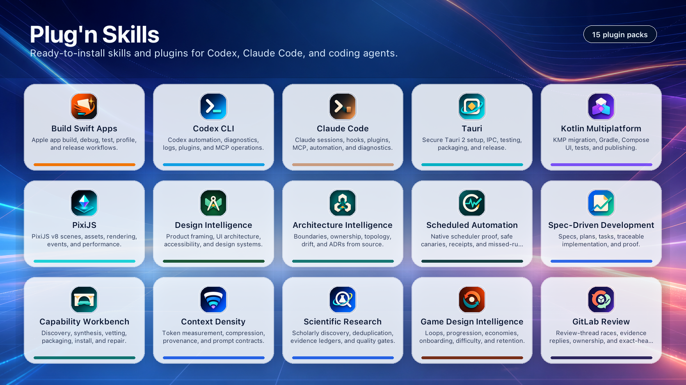

# Plug'n Skills

Ready-to-install skills and plugins that make coding agents better at real
development work.

Plug'n Skills is a library of plugin packs for Codex, Claude Code, Cursor, and
other coding agents. The source tree is agent-agnostic: every pack works from
any of those hosts and is never locked to one of them. Each pack gives an
agent a focused workflow: what to inspect, which
commands to run, what to verify, and when to use a deterministic helper instead
of improvising from a prompt.

Use it when you want an agent to handle more than generic code edits:

- build, debug, profile, test, package, and release Swift apps;
- work with Kotlin Multiplatform, Tauri, PixiJS, Codex CLI, and Claude Code;
- review architecture, product direction, interface quality, and game systems;
- plan scientific research, spec-driven delivery, context compression, and
  agent capability synthesis.

The repository ships 15 installable plugin packs and 150+ focused agent
skills, all plain repository content: manifests, `SKILL.md` files, references,
validators, and helper scripts. Inspect it, validate it from a fresh clone,
install only the packs you need, and keep generated local marketplace or cache
state out of the repo.

## Quick Start

### Easiest: Ask Your Agent

Paste this prompt into the coding agent you already use:

```text
Install Plug'n Skills from https://github.com/Xopoko/plug-n-skills on this
computer. Follow the repository instructions for the coding agent you are
running in, validate the source tree first, use a dry run before writing global
plugin state, install only the plugin packs I request unless I ask for all of
them, and report exactly what was changed.
```

### Clone And Validate

```bash
git clone https://github.com/Xopoko/plug-n-skills.git
cd plug-n-skills
python3 scripts/validate-repository.py
```

### Codex

Preview the Codex install plan before writing global state:

```bash
python3 scripts/install-codex-plugins.py --dry-run
```

Install or refresh every plugin from this checkout:

```bash
python3 scripts/install-codex-plugins.py
python3 scripts/install-codex-plugins.py --check-only
```

Install only selected plugin packs:

```bash
python3 scripts/install-codex-plugins.py --plugin capability-workbench
python3 scripts/install-codex-plugins.py \
  --plugin kotlin-multiplatform \
  --plugin spec-driven-development
```

Exclude plugin packs that are not useful on the current host:

```bash
python3 scripts/install-codex-plugins.py \
  --exclude-plugin build-swift-apps \
  --exclude-plugin kotlin-multiplatform
```

The installer validates the repository, generates a local Codex marketplace
file at `.agents/plugins/marketplace.json`, points Codex's `local` marketplace
at this checkout, enables the selected plugins, and materializes cache entries
under `~/.codex/plugins/cache/local/...`.

`.agents/` and Codex cache directories are local runtime state, not part of
the published source tree.

### Claude Code

Add this repository as a Claude Code marketplace, then install the pack you
need:

```text
/plugin marketplace add Xopoko/plug-n-skills
/plugin install capability-workbench@xopoko-plug-n-skills
/reload-plugins
```

For a local checkout, use its path instead of the GitHub shorthand:

```text
/plugin marketplace add /path/to/plug-n-skills
```

Claude Code reads the root `.claude-plugin/marketplace.json` and each plugin's
`.claude-plugin/plugin.json`.

### Cursor

Cursor consumes `SKILL.md` folders directly and has no plugin marketplace.
Install (or refresh) the repository skills into Cursor's global skills
directory:

```bash
python3 scripts/install-cursor-skills.py --dry-run
python3 scripts/install-cursor-skills.py
python3 scripts/install-cursor-skills.py --check-only
```

Use repeated `--plugin` or `--exclude-plugin` flags when a host should only see
part of the repository.

The installer is idempotent: unchanged skills are skipped, drifted skills are
replaced to match the repository source, and repeated runs converge.

## Included Plugin Packs

| Plugin | Use it for |
| --- | --- |
| `architecture-intelligence` | Source-backed architecture audits, ownership and runtime topology, module boundaries, ADRs, fitness functions, conformance checks, and refactoring strategy. |
| `build-swift-apps` | Building, debugging, profiling, testing, packaging, and releasing Swift apps across iOS and macOS. |
| `capability-workbench` | Capability discovery, synthesis, plugin packaging, agent guidance files, trigger metadata, install-scope decisions, vetting, repair, icon workflows, and visibility checks. |
| `claude-code` | Claude Code CLI operations, print-mode automation, diagnostics, plugin and MCP lifecycle, hooks, settings, agents, sessions, and worktrees. |
| `codex-cli` | Codex CLI operations, automation, diagnostics, live thread supervision, controlled skill handoffs and evidence corrections, plugin and MCP lifecycle, normalized session trace audits, and local environment actions. |
| `scheduled-automation` | Local scheduler diagnostics, real-runtime proof, safe canaries, correlated run receipts, missed-run analysis, and rollback-aware repair. |
| `gitlab-review` | Race-safe GitLab merge request review response, reviewer-owned resolution, idempotent thread replies, and exact-head handoff proof. |
| `context-density` | Context design, long-context placement, research-backed acceptance gates, prompt contracts, skill compression, structural handoff, and validation reporting. |
| `design-intelligence` | Product framing, interface architecture, interaction design, visual hierarchy, accessibility, and design-system governance. |
| `game-design-intelligence` | Gameplay loops, systems, progression, economies, motivation, retention, onboarding, difficulty, multiplayer, and live-service critique. |
| `kotlin-multiplatform` | Kotlin Multiplatform architecture, Gradle diagnosis, Compose Multiplatform, iOS interop, testing, security, publishing, and production readiness. |
| `pixijs` | PixiJS v8 application setup, scene graph, rendering, assets, events, filters, migration, and performance. |
| `scientific-research` | Scholarly discovery, deduplication, source routing, claim ledgers, provenance, and evidence quality gates. |
| `spec-driven-development` | Spec-driven workflows with lane selection, Spec Kit integration, requirements quality, traceability, implementation, and proof gates. |
| `tauri` | Tauri 2 setup, migration, configuration security, IPC, plugins, shell UI, debugging, testing, distribution, and mobile workflows. |

See [plugins/README.md](plugins/README.md) for the per-plugin source index and
manifest identifiers.

## Token Efficiency

This collection is designed around progressive disclosure. Agents can
route from lightweight metadata first, then load the selected
`SKILL.md` body only for the chosen workflow.

These estimates are generated with `scripts/token-report.py` using
`tiktoken` and the `o200k_base` encoding. Different agents may
wrap metadata differently, so the exact number is less important than
the split between always-visible routing metadata and on-demand skill
instructions.

| Metric | Count | Tokens | Notes |
| --- | ---: | ---: | --- |
| Plugin packs | 15 | - | Installable packages under `plugins/`. |
| Skill entrypoints | 161 | - | `SKILL.md` files exposed through plugin metadata. |
| Reference files | 220 | - | Longer ledgers, contracts, scorecards, and source notes. |
| Helper and validator scripts | 77 | - | Deterministic plugin-local helpers. |
| Startup metadata | 161 skills | 12,573 | Skill name, description, and file pointer for routing. |
| On-demand skill bodies | 161 skills | 104,055 | Instruction bodies after frontmatter, loaded only when selected. |

Regenerate the report after skill edits:

```bash
python3 scripts/token-report.py
```

### Plugin Token Rollup

Descriptions are split from the numeric rollup so GitHub does not
compress long prose into narrow table cells.

Token columns are `startup metadata / on-demand body`.

| Plugin | Skills | Refs | Scripts | Startup | Body |
| --- | ---: | ---: | ---: | ---: | ---: |
| `build-swift-apps` | 61 | 89 | 36 | 4,743 | 35,699 |
| `pixijs` | 26 | 64 | 0 | 1,861 | 7,967 |
| `tauri` | 6 | 0 | 1 | 481 | 3,235 |
| `scientific-research` | 1 | 4 | 1 | 91 | 2,024 |
| `context-density` | 1 | 8 | 7 | 128 | 2,713 |
| `capability-workbench` | 10 | 14 | 21 | 942 | 12,040 |
| `codex-cli` | 7 | 4 | 2 | 619 | 7,491 |
| `scheduled-automation` | 1 | 5 | 0 | 103 | 1,158 |
| `gitlab-review` | 1 | 3 | 1 | 117 | 1,083 |
| `claude-code` | 6 | 2 | 1 | 528 | 4,669 |
| `architecture-intelligence` | 8 | 7 | 2 | 523 | 5,123 |
| `design-intelligence` | 7 | 2 | 1 | 472 | 5,101 |
| `game-design-intelligence` | 6 | 2 | 1 | 536 | 2,916 |
| `kotlin-multiplatform` | 14 | 16 | 1 | 1,096 | 9,569 |
| `spec-driven-development` | 6 | 0 | 2 | 333 | 3,267 |

### Plugin Focus

| Plugin | Description |
| --- | --- |
| `build-swift-apps` | Agent skills for building, debugging, profiling, testing, refactoring, and shipping Swift apps across Apple platforms. |
| `pixijs` | PixiJS v8 skill collection: application setup, scene graph, assets, events, filters, rendering, performance, v7->v8 migration, and project scaffolding. |
| `tauri` | Tauri 2 development: project setup/migration, tauri.conf & capabilities/security, Rust IPC & plugins, shell UI, debug/test, and distribution/mobile release. |
| `scientific-research` | Disciplined scholarly research workflow: discovery, source routing, DOI dedup, claim ledgers, and evidence quality gates across arXiv/OpenAlex/Crossref/Europe PMC/Semantic Scholar/NCBI/CORE/OpenCitations. |
| `context-density` | Context design, prompt-contract optimization, research-backed acceptance gates, compression validation, and structural handoff for agent skills, plugins, prompts, docs, and workflows. |
| `capability-workbench` | Agent-agnostic capability workbench: discover, synthesize, architect portfolios, design trigger metadata and agent guidance files, vet, repair, install, package, and run imagegen-backed icon workflows for agent skills and plugins. |
| `codex-cli` | Codex CLI operations, automation, diagnostics, live thread supervision, plugin and MCP lifecycle, session log forensics, and local environment actions. |
| `scheduled-automation` | Local scheduler diagnostics, real-runtime proof, safe canaries, correlated run receipts, and missed-run analysis for launchd, systemd timers, cron, and Windows Task Scheduler. |
| `gitlab-review` | Race-safe GitLab merge request review response with complete discussion inventory, reviewer-owned resolution, idempotent replies, and exact-head handoff proof. |
| `claude-code` | Claude Code CLI operations, print-mode automation, diagnostics, plugin and MCP lifecycle, hooks, settings, agents, sessions, and worktrees. |
| `architecture-intelligence` | Source-backed software architecture intelligence for codebase audits, ownership topology, runtime topology, architecture conformance and drift checks, structure metrics, module boundaries, dependency flow, ADRs, architecture fitness functions, and incremental refactoring strategy. |
| `design-intelligence` | Source-backed, technology-agnostic UI/UX judgment: product framing, information architecture, interaction design, usability/accessibility review, visual communication, and design-system governance. Deliberately avoids Figma automation, framework recipes, and CSS recipes. |
| `game-design-intelligence` | Source-backed game design judgment: core loops, gameplay systems, progression/economy/balance, motivation/retention, onboarding/difficulty, and multiplayer/live-service dynamics. Avoids engines, graphics, and implementation code. |
| `kotlin-multiplatform` | Kotlin Multiplatform development, migration, Gradle diagnosis, Compose Multiplatform, interop, testing, data, governance, performance, security, publishing, and production readiness. |
| `spec-driven-development` | Spec-Driven Development: route intent into specs, plans, tasks, traceability, implementation, and proof. |

### Skill Token Index

Token cells are shown as `startup/body`.

#### `build-swift-apps`

| Skill | Tokens | Description |
| --- | ---: | --- |
| `app-icon-studio` | 70/984 | Create, generate, evaluate, export, install, or debug iOS and macOS app icons, including AppIcon.appiconset assets and macOS .icns bundle icons. |
| `apple-dev-research` | 67/503 | Search Apple Dev Search for Swift, SwiftUI, Xcode, iOS, macOS, and Apple-platform community articles, tutorials, blogs, and write-ups. |
| `apple-firmware-inspector` | 87/676 | Apple firmware and binary reverse engineering with the `ipsw` CLI: IPSW/kernelcache download/extraction, dyld_shared_cache disassembly, private headers, entitlements, Mach-O analysis, Apple internals, KEXTs, and security research. |
| `appstore-ads-operator` | 72/843 | Manage Apple Ads with `asc ads`: separate auth, org lookup, campaigns, ad groups, ads, keywords, reports, raw API requests, and safe live testing. |
| `appstore-archive-uploader` | 73/800 | Manage Xcode version/build numbers, archive, export, upload, and publish IPA/PKG artifacts with `asc xcode` helpers before TestFlight or App Store submission. |
| `appstore-aso-auditor` | 80/687 | Run an offline ASO audit on canonical App Store metadata under `./metadata` and, when available, add Astro MCP keyword-gap analysis and Apple app-tag context. Use after `asc metadata pull`. |
| `appstore-build-monitor` | 60/334 | Track build processing, find latest builds, and clean up old builds with asc. Use when managing build retention or waiting on processing. |
| `appstore-connect-cli` | 65/521 | Use `asc` CLI for App Store Connect command discovery, auth, output formats, pagination, schemas, canonical verbs, Apple Ads, and timeout behavior. |
| `appstore-crash-insights` | 69/494 | Triage TestFlight crashes, beta feedback, hangs, disk writes, launches, and performance diagnostics with `asc` crash/feedback/diagnostics commands. |
| `appstore-id-resolver` | 65/318 | Resolve App Store Connect IDs (apps, builds, versions, groups, testers) from human-friendly names using asc. Use when commands require IDs. |
| `appstore-metadata-localizer` | 96/425 | Use when App Store listing text must be translated or market-adapted across locales, including descriptions, keywords, What's New, subtitles, names, privacy text, and App Store Connect languages. Not for non-translation metadata edits, release-note drafting, or subscription/IAP display-name localization. |
| `appstore-metadata-sync` | 85/436 | Use when App Store listing metadata in canonical `./metadata` JSON needs field edits, validation, push, keyword sync, or legacy fastlane migration. Not for translation-first localization, release-note drafting, or subscription/IAP display-name localizations. |
| `appstore-notary-runner` | 82/485 | Use for the concrete macOS Developer ID notarization command path with xcodebuild export plus `asc notarization` submit, status, log, and stapling. Not for broad packaging readiness review or signing-only diagnosis. |
| `appstore-pricing-planner` | 75/402 | Set territory-specific subscription and IAP pricing with `asc` setup, pricing summary, CSV import, price-point, availability, and schedule commands. Use for PPP or localized pricing strategies. |
| `appstore-record-creator` | 68/570 | Create a new App Store Connect app record through visible browser automation when no public API exists. Use for the New App web form after the bundle ID is registered. |
| `appstore-release-director` | 88/726 | End-to-end iOS App Store publishing from local repo to App Store Connect readiness, upload, TestFlight, App Review submission/resubmission, or review issue triage, including signing, metadata, privacy, icons, screenshots, subscriptions, and release evidence. |
| `appstore-release-notes-writer` | 88/688 | Use when the requested App Store artifact is What's New release notes or promotional text, drafted from git history, bullets, or free text and optionally localized. Not for full listing translation, canonical metadata field sync, or subscription/IAP display names. |
| `appstore-release-planner` | 93/722 | Answer App Store release go/no-go questions and choose the next focused release skill. Use for readiness planning, first-submission blockers, release sequencing, or deciding whether to stage or submit; use appstore-review-readiness for concrete validate, submit, monitor, cancel, and repair commands. |
| `appstore-revenuecat-sync` | 81/784 | Reconcile App Store Connect subscriptions/IAPs with RevenueCat products, entitlements, offerings, and packages using `asc` plus RevenueCat MCP. Use for catalog bootstrap, drift audits, and deterministic product mapping. |
| `appstore-review-readiness` | 88/440 | Validate App Store submission readiness and execute prepared review actions with current `asc` commands. Use after appstore-release-planner chooses the review path, or when the user directly asks to validate, stage, submit, monitor, cancel, or repair ASC review blockers. |
| `appstore-screenshot-pipeline` | 72/1,013 | Orchestrate iOS screenshot automation with xcodebuild/simctl, AXe plans, Koubou framing, review artifacts, and `asc screenshots` upload. |
| `appstore-screenshot-studio` | 73/653 | Create, revise, translate, scrape, crop, validate, and prepare App Store marketing screenshots and `.appstore-screenshots` workspaces. Not for general image generation. |
| `appstore-screenshot-validator` | 67/420 | Resize, strip alpha, color-convert, validate, and upload App Store screenshots using current `asc screenshots` size data and macOS `sips`. |
| `appstore-signing-setup` | 65/646 | Set up App Store Connect bundle IDs, capabilities, certificates, provisioning profiles, local profile install, and encrypted signing sync with `asc`. |
| `appstore-subscription-localizer` | 82/402 | Use when App Store subscription groups, subscriptions, or in-app purchases need localized display names or descriptions created or updated with `asc`. Not for app listing metadata, What's New release notes, keywords, screenshots, or pricing. |
| `appstore-testflight-coordinator` | 64/346 | Orchestrate TestFlight distribution, groups, testers, and What to Test notes using asc. Use when rolling out betas. |
| `appstore-wall-publisher` | 88/373 | Submit or update a Wall of Apps entry in the App-Store-Connect-CLI repository using `asc apps wall submit`. Use when the user says "submit to wall of apps", "add my app to the wall", or "wall-of-apps". |
| `appstore-workflow-runner` | 74/793 | Define, validate, run, resume, and audit repo-local `.asc/workflow.json` automations with current `asc workflow`, including safe release/TestFlight flows and step outputs. |
| `build-swift-apps` | 91/758 | Route broad or ambiguous Swift and Apple-platform work across the Build Swift Apps skill pack. Use before choosing among adjacent iOS, macOS, SwiftUI, Xcode, simulator, App Store Connect, Tuist, SwiftPM, signing, profiling, or Apple research skills. |
| `ios-ettrace-profiler` | 69/1,034 | Capture and interpret symbolicated ETTrace profiles for iOS simulator startup, scrolling, navigation, rendering, runtime flows, before/after comparisons, and CPU hotspots. |
| `ios-intents-architect` | 78/556 | Design and implement App Intents, AppEntity, EntityQuery, and App Shortcuts for iOS system surfaces such as Shortcuts, Siri, Spotlight, widgets, controls, and app handoff routes. |
| `ios-liquid-glass-designer` | 78/452 | Implement, refactor, or review iOS 26+ SwiftUI Liquid Glass features using native `glassEffect`, `GlassEffectContainer`, glass button styles, availability gates, and fallbacks. |
| `ios-memgraph-inspector` | 71/581 | Capture, inspect, compare, and prove iOS leaks with Apple's `leaks`, simulator memgraphs, retain-cycle evidence, and before/after leak summaries. |
| `ios-rocketsim-operator` | 77/486 | Use RocketSim for iOS Simulator UI inspection and interaction, including visible accessibility state, taps, long-presses, swipes, typing, hardware buttons, and RocketSim CLI automation. |
| `ios-simulator-browser` | 91/805 | Prefer this over plain simulator-only workflows when the user should watch, interact with, or receive browser-visible proof of an iOS Simulator run. Use to mirror an iOS Simulator into the Codex in-app browser and render SwiftUI previews from importable Swift packages with hot reload. |
| `ios-simulator-debugger` | 92/532 | Build, run, launch, inspect, interact with, and debug iOS simulator apps using XcodeBuildMCP tools, UI descriptions, screenshots, and log capture. Prefer ios-simulator-browser for user-facing browser mirrors, visible simulator proof, or SwiftUI preview viewing. |
| `ios-swiftui-architect` | 80/708 | Build or refactor iOS SwiftUI views/components: navigation, TabView, sheets, async state, responsive stacks/grids, state ownership, environment injection, previews, and performance-aware declarative UI. |
| `macos-appkit-bridge` | 96/566 | Decide when and how to bridge a macOS app from SwiftUI into AppKit. Use when implementing NSViewRepresentable or NSViewControllerRepresentable, accessing NSWindow or the responder chain, presenting panels, customizing menus, or handling desktop behaviors that SwiftUI does not model cleanly. |
| `macos-liquid-glass-designer` | 87/593 | Implement, refactor, or review modern macOS SwiftUI Liquid Glass UI: NavigationSplitView, toolbars, search, sheets, controls, system materials, `glassEffect`, `GlassEffectContainer`, and `glassEffectID`. |
| `macos-notarization-packager` | 89/305 | Use when preparing or diagnosing macOS Developer ID distribution artifacts, including archives, exported app bundles, bundle structure, hardened runtime, notarization readiness, or distribution-only failures. Not for local signing-only diagnosis or direct `asc notarization` execution. |
| `macos-runtime-debugger` | 84/770 | Build, run, and debug local macOS apps or desktop executables with shell-first Xcode/Swift workflows. Use for Mac app builds, launch scripts, compiler/linker/startup failures, logs, telemetry, or desktop runtime debugging. |
| `macos-signing-inspector` | 78/428 | Use when an existing macOS app or binary needs code-signing, entitlement, hardened runtime, sandbox, Gatekeeper, or trust-policy diagnosis. Not for full distribution packaging or running notarization submissions. |
| `macos-swiftpm-runner` | 85/280 | Build, run, and test pure SwiftPM-based macOS packages and executables. Use when the repo is package-first, when there is no Xcode project, or when Swift package workflows are the fastest path to diagnosis. |
| `macos-swiftui-architect` | 78/821 | Build or refactor native macOS SwiftUI scenes and components: windows, commands, toolbars, settings, split views, inspectors, menu bar extras, keyboard workflows, and desktop layouts. |
| `macos-telemetry-probe` | 72/412 | Add and verify lightweight macOS runtime telemetry with `Logger`/`os.Logger`, `log stream`, Console filters, signposts, and build-run checks. |
| `macos-test-diagnoser` | 83/323 | Triage failing macOS tests across Xcode and SwiftPM workflows. Use when asked to run macOS tests, narrow failing scopes, explain assertion or crash failures, or separate real test regressions from setup and environment problems. |
| `macos-view-architect` | 70/500 | Refactor macOS SwiftUI views/scenes into small stable subviews, explicit scene roots, command/toolbar ownership, scene-aware state, and narrow AppKit bridges. |
| `macos-window-architect` | 76/799 | Customize macOS 15+ SwiftUI windows and scene behavior: toolbar/title visibility, drag regions, window materials, minimize/restoration, default/ideal placement, launch behavior, and borderless windows. |
| `swiftpm-build-inspector` | 71/536 | Analyze Swift Package Manager dependencies, plugins, module variants, branch pins, package graph shape, macros, binary targets, and CI/local build overhead that slow Xcode builds. |
| `swiftui-performance-inspector` | 70/543 | Audit SwiftUI runtime performance from code and profiling evidence for slow rendering, janky scrolling, high CPU or memory, excessive updates, hangs, and layout thrash. |
| `swiftui-view-architect` | 69/481 | Refactor SwiftUI view files toward small dedicated subviews, MV-first data flow, stable view trees, explicit dependencies, extracted actions, and correct Observation usage. |
| `tuist-flaky-test-stabilizer` | 83/554 | Investigate and fix flaky tests using Tuist test insights and local repeated test runs. Use when a user provides a flaky test URL, test case identifier, or asks to find and stabilize flaky tests. |
| `tuist-generation-doctor` | 77/629 | Debug Tuist-generated project failures across generation, build, and runtime. Use when `tuist generate`, generated Xcode workspaces, or generated app launches fail or behave differently from the source project. |
| `tuist-migration-planner` | 75/577 | Migrate existing Xcode projects toward Tuist-generated workspaces. Use when converting hand-maintained Xcode projects, mapping targets/settings/dependencies, or validating generated builds and launches. |
| `tuist-workspace-navigator` | 80/500 | Work productively in Tuist-generated Xcode workspaces. Use for `tuist generate`, generated workspace builds, focused generation, tags, buildable folders, and Xcode build/test commands after generation. |
| `xcode-build-baseline` | 66/550 | Benchmark Xcode clean, cached-clean, zero-change, and incremental builds with repeatable inputs, timing summaries, and `.build-benchmark/` artifacts. |
| `xcode-build-strategist` | 78/959 | Recommend-first Xcode build optimization: benchmark, run specialist analyses, prioritize wall-clock findings, request approval, delegate fixes, and re-benchmark. Use for speeding up Xcode builds or full build audits. |
| `xcode-build-tuner` | 77/749 | Apply approved Xcode build optimization changes and re-benchmark. Use after `xcode-build-strategist` approval, or for explicit build-setting, script-phase, Swift compilation, or SwiftPM graph fixes. |
| `xcode-compile-profiler` | 70/494 | Analyze Swift and mixed-language compile hotspots from timing summaries, Swift frontend diagnostics, type-checking warnings, CompileSwiftSources, SwiftEmitModule, and related build evidence. |
| `xcode-project-auditor` | 68/483 | Audit Xcode project configuration, schemes, build settings, target dependencies, run scripts, module maps, explicit modules, and fixed build overhead with approval gates. |
| `xcode-ui-test-stabilizer` | 97/451 | Create, stabilize, and run UI end-to-end tests with Xcode (XCUIApplication/xcodebuild), including environment setup, focus/input stabilization, logging/attachments, and flakiness triage. Use when adding or debugging UI automation, writing new UI tests, or making them reliable. |

#### `pixijs`

| Skill | Tokens | Description |
| --- | ---: | --- |
| `pixijs` | 73/690 | Use first for PixiJS v8 tasks. Router for Application/app.init, scene graph Container/Sprite/Graphics/Text/Mesh, Assets, events, Ticker, filters, shaders, performance, migration, and create-pixi. |
| `pixijs-accessibility` | 63/199 | Use for PixiJS v8 accessibility: AccessibilitySystem, screen reader overlays, keyboard navigation, accessibleTitle, accessibleHint, tabIndex, roles, activation settings. |
| `pixijs-application` | 73/395 | Use for PixiJS v8 Application setup, app.init, renderer/canvas/screen/stage, resizeTo, ticker/sharedTicker, CullerPlugin, app.start/stop/destroy, releaseGlobalResources. |
| `pixijs-assets` | 71/398 | Use for PixiJS v8 Assets: Assets.init/load/add/unload, bundles, manifests, cache, onProgress, background loading, spritesheets, video, SVG, fonts, compressed textures, parser selection. |
| `pixijs-blend-modes` | 76/220 | Use for PixiJS v8 blend modes and compositing: normal/add/multiply/screen/erase/min/max, advanced-blend-modes, overlay, color-burn, hard-light, alpha behavior. |
| `pixijs-color` | 70/256 | Use for PixiJS v8 Color: hex/CSS/rgb/hsl inputs, toHex/toNumber/toArray/toRgbaString, multiply, premultiply, alpha, tint, color-space conversion. |
| `pixijs-core-concepts` | 68/243 | Use for PixiJS v8 renderer concepts: Application/Renderer relationship, WebGL/WebGPU/Canvas selection, render loop, systems, pipes, environment adapters, renderer fallback. |
| `pixijs-create` | 69/249 | Use for PixiJS v8 project scaffolding with create-pixi: npm/yarn/pnpm/bun create commands, Vite templates, React template, non-interactive flags, existing project setup. |
| `pixijs-custom-rendering` | 73/266 | Use for PixiJS v8 custom rendering: Shader.from, GlProgram/GpuProgram, UniformGroup typed uniforms, textures as resources, custom Filter, batchers, WebGL/WebGPU shader code. |
| `pixijs-environments` | 70/230 | Use for PixiJS v8 environments outside normal browser pages: Web Workers, OffscreenCanvas, Node/SSR, CSP, DOMAdapter, BrowserAdapter, WebWorkerAdapter, unsafe-eval. |
| `pixijs-events` | 67/281 | Use for PixiJS v8 input events: pointer/mouse/touch/wheel, eventMode, FederatedEvent, propagation/capture, hitArea, cursor, drag, interactiveChildren. |
| `pixijs-filters` | 70/262 | Use for PixiJS v8 filters and visual effects: BlurFilter, ColorMatrixFilter, DisplacementFilter, NoiseFilter, Filter.from, padding/resolution, pixi-filters community effects. |
| `pixijs-html-source` | 68/231 | Use for PixiJS v8 experimental HTMLSource and ElementImageSource: render DOM/HTML snapshots as textures, pixi.js/html-source, requestPaint, feature detection, fallbacks. |
| `pixijs-math` | 71/342 | Use for PixiJS v8 math: Point, ObservablePoint, Matrix, Rectangle, Circle, Ellipse, Polygon, Triangle, hit testing, bounds, toGlobal/toLocal, math-extras. |
| `pixijs-migration-v8` | 77/350 | Use for PixiJS v7 to v8 migration: app.init, pixi.js package imports, Graphics fill/stroke/cut, Texture/BaseTexture changes, events, ticker, shaders, filters, adapters. |
| `pixijs-performance` | 70/363 | Use for PixiJS v8 performance: FPS, jank, draw calls, batching, GPU memory, destroy patterns, cacheAsTexture, GCSystem, PrepareSystem, Culler, pooling, resolution. |
| `pixijs-scene-container` | 69/376 | Use for PixiJS v8 Container: addChild/removeChild, transforms, sortableChildren/zIndex, boundsArea, culling, render groups, masks, coordinate conversion, destroy. |
| `pixijs-scene-core-concepts` | 74/325 | Use for PixiJS v8 scene graph concepts: containers vs leaves, transforms, local/world coordinates, render order, masks, RenderLayer, render groups, culling, scene management. |
| `pixijs-scene-dom-container` | 71/222 | Use for PixiJS v8 DOMContainer overlays: HTML elements attached to scene nodes, pixi.js/dom import, element/anchor options, CSS transforms, visibility and resize sync. |
| `pixijs-scene-gif` | 79/263 | Use for PixiJS v8 animated GIFs: pixi.js/gif import, Assets.load to GifSource, GifSprite playback, autoPlay/loop, currentFrame, animationSpeed, callbacks, clone/destroy. |
| `pixijs-scene-graphics` | 81/413 | Use for PixiJS v8 Graphics, GraphicsContext, vector shapes and paths: rect/circle/poly, moveTo/lineTo/arc, fill/stroke/cut, gradients, patterns, SVG import/export, hit testing. |
| `pixijs-scene-mesh` | 73/276 | Use for PixiJS v8 Mesh and custom geometry: MeshGeometry positions/uvs/indices/topology, MeshSimple, MeshPlane, MeshRope, PerspectiveMesh, vertex animation. |
| `pixijs-scene-particle-container` | 70/320 | Use for PixiJS v8 ParticleContainer and Particle: thousands of lightweight sprites, addParticle/removeParticle, particleChildren, dynamicProperties, boundsArea, roundPixels. |
| `pixijs-scene-sprite` | 73/268 | Use for PixiJS v8 image sprites: Sprite, AnimatedSprite, NineSliceSprite, TilingSprite, texture/anchor/tint, frame animation, scalable UI panels, repeating backgrounds. |
| `pixijs-scene-text` | 70/258 | Use for PixiJS v8 text rendering: Text, TextStyle, BitmapText, HTMLText, SplitText, SplitBitmapText, dynamic labels, glyph atlas performance, styled markup. |
| `pixijs-ticker` | 72/271 | Use for PixiJS v8 Ticker and render loop control: add/addOnce/remove, deltaTime/deltaMS/elapsedMS, UPDATE_PRIORITY, maxFPS/minFPS, speed, shared/private ticker. |

#### `tauri`

| Skill | Tokens | Description |
| --- | ---: | --- |
| `tauri-config-security` | 68/658 | Configure or review Tauri 2 tauri.conf files, capabilities, permissions, CSP, scoped filesystem/network/shell access, window labels, plugin permissions, and security-sensitive frontend API exposure. |
| `tauri-debug-testing` | 77/577 | Debug, test, or stabilize Tauri 2 apps, including Rust compile/runtime errors, frontend API mocks, permissions failures, dev/build mismatches, WebDriver, CI checks, logs, DevTools, and platform-specific test gaps. |
| `tauri-distribution-mobile` | 82/470 | Package, sign, notarize, update, release, or validate Tauri 2 desktop/mobile builds, including bundle targets, updater signatures, macOS/Windows/Linux distribution, Android/iOS setup, CI release checks, and store-readiness planning. |
| `tauri-ipc-plugins` | 77/465 | Implement or review Tauri 2 Rust commands, frontend invoke wrappers, events, Channels, custom errors, state, official plugins, or custom Tauri plugins across Rust, JavaScript, permissions, and mobile surfaces. |
| `tauri-projects` | 98/605 | Start, inspect, scaffold, migrate, or orient Tauri 2 projects. Use when a task mentions creating a Tauri app, adding Tauri to an existing frontend, src-tauri project structure, package-manager selection, framework selection, Tauri 1 to 2 migration, or "what shape is this Tauri repo in? |
| `tauri-shell-ui` | 79/460 | Build or review Tauri 2 desktop shell features: windows, webviews, menus, tray icons, custom titlebars, resources, icons, state, sidecars, opener/shell APIs, deep links, and native-feeling desktop interactions. |

#### `scientific-research`

| Skill | Tokens | Description |
| --- | ---: | --- |
| `scientific-research` | 91/2,024 | Use for scientific or scholarly research with source traceability, literature reviews, paper discovery, arXiv/OpenAlex/Crossref/Europe PMC/Semantic Scholar/PubMed queries, corpus building, DOI deduplication, source-backed claim extraction, evidence synthesis, or research quality validation. |

#### `context-density`

| Skill | Tokens | Description |
| --- | ---: | --- |
| `context-density` | 128/2,713 | Use when designing, auditing, refactoring, measuring, or validating token-efficient context and prompt/output contracts. Trigger for AGENTS.md, prompts, skill packages, marketplace plugins, MCP/tool schemas, long-context placement, prompt/context compression, retrieval provenance, runtime context diagnostics, duplicated or overlapping prose, competing skill descriptions, irrelevant-context pruning, prompt reformatting, agent/subagent context handoffs, brittle trigger descriptions, strict JSON/schema/tool-call output, validators, retry/repair loops, or behavior-preserving token reduction. |

#### `capability-workbench`

| Skill | Tokens | Description |
| --- | ---: | --- |
| `agent-guidance-factory` | 119/678 | Create, refresh, audit, or migrate repository agent guidance files such as AGENTS.md, AGENTS.override.md, CLAUDE.md, .claude/rules, and Cursor rules. Use when a repo needs durable coding-agent instructions, instruction load-order decisions, nested guidance, or cleanup of bloated or stale agent docs. Do not use for ordinary human README or CONTRIBUTING docs unless they must feed agent guidance. |
| `capability-auditor` | 97/1,291 | Use when auditing agent skills or plugins for safety, coverage, duplicated logic, token/context cost, prompt-contract risk, validation readiness, marketplace visibility, dependencies, network behavior, or install/update risk. For structural split/merge/move/delete/router decisions across skills or plugins, use capability-portfolio-architect instead. |
| `capability-portfolio-architect` | 103/937 | Use when auditing agent skill/plugin portfolio architecture for cross-plugin capability overlap, weak routing, duplicated or missing skills, split/merge/delete/move decisions, shared capability extraction, reference/script extraction, or plugin boundary redesign. For safety, coverage, or validation review of a single artifact without boundary changes, use capability-auditor instead. |
| `capability-reality-repair` | 92/819 | Repair stale or false agent capability instructions immediately. Use when a skill, script, plugin manifest/helper, MCP/tool contract, connector guidance, validator, or bundled reference describes commands, schemas, paths, outputs, install state, dependencies, or behavior that does not match live reality. |
| `capability-synthesizer` | 126/2,215 | Use when performing broad external-first discovery, vetting, scoring, distillation, or synthesis of agent skills or plugin packs from the public web, GitHub/public repositories, OpenClaw/ClawHub, marketplaces, research sources, community implementations, user references, or local skills. Use for well-vetted capability synthesis, cross-skill comparison, plugin-pack synthesis, global capability acquisition, skill strengthening, and adoption/rejection changelogs. |
| `capability-workbench` | 74/1,708 | Route and orchestrate agent skill and plugin lifecycle work. Use when work involves agent skills, plugins, marketplace packages, capability acquisition, synthesis, creation, installation, packaging, audit, or context-density optimization. |
| `plugin-factory` | 82/1,238 | Use when creating, updating, validating, optionally installing/cache-refreshing, or handing off marketplace-backed agent plugins. Use for plugin manifests, local marketplace entries, plugin-pack synthesis, triggerable skill bundles, install visibility gates, and Codex app deeplinks. |
| `skill-factory` | 82/1,341 | Use when creating, refactoring, splitting, compressing, validating, or packaging agent skills. Use for SKILL.md trigger design, agents/openai.yaml metadata, skill resources, progressive disclosure, token-efficient instructions, quick validation, and plugin-contained skills. |
| `skill-installer-vetter` | 82/942 | Find, list, vet, install, or update agent skills from curated catalogs, GitHub repo paths, local folders, or user-provided references. Use when installation must be preceded by provenance, safety, dependency, and capability checks. |
| `skill-trigger-metadata` | 85/871 | Use when creating, editing, auditing, or debugging skill names, descriptions, SKILL.md frontmatter, plugin skill metadata, discovery triggers, routing phrases, under-triggering, over-triggering, or cases where a relevant skill is not being invoked or read. |

#### `codex-cli`

| Skill | Tokens | Description |
| --- | ---: | --- |
| `codex-cli` | 80/1,008 | Route Codex CLI work across local CLI inspection, non-interactive exec/review automation, live task and thread supervision, plugin and MCP management, doctor/debug/sandbox/app-server diagnostics, session log forensics, and Codex app local environment actions. |
| `codex-doctor-debugger` | 82/839 | Use when diagnosing Codex CLI install, config, auth, runtime, feature flags, sandbox denials, debug models, prompt input, app-server, remote-control, remote websocket/unix connections, or local Codex health failures. |
| `codex-environments` | 84/995 | Create, update, debug, or remove Codex app local project environments and actions, including `.codex/environments/environment.toml`, Run/Test/Preview buttons, startup commands, simulator/browser/dev-server launch actions, environment variables, and repeatable local commands. |
| `codex-exec-automation` | 97/1,018 | Use when preparing, running, debugging, or reviewing non-interactive Codex CLI automation with `codex exec`, `codex exec resume`, `codex review`, JSONL events, output schemas, last-message files, cwd/profile/config flags, sandbox and approval modes, or CI-style agent runs. |
| `codex-log-reader` | 93/1,279 | Use when locating, summarizing, auditing, or debugging Codex session rollout JSONL logs by CODEX_THREAD_ID, cwd, query, issue key, project path, child or inherited-history symptoms, malformed or huge log symptoms, permission concerns, or "what happened in this Codex thread" questions. |
| `codex-plugin-mcp-manager` | 77/895 | Use when managing Codex CLI plugins, plugin marketplaces, local marketplace refreshes, cache visibility, MCP server list/get/add/remove/login/logout, MCP bearer token environment variables, or plugin/MCP installation failures. |
| `codex-thread-supervisor` | 106/1,457 | Use when watching, monitoring, following, or supervising one or more live Codex tasks or threads by ID, including cursor-based transitions, completion or attention gates, claim checks, compact checkpoints, narrowly authorized skill handoffs or evidence corrections, and privacy-safe capability mining. Not for post-hoc rollout forensics, current-turn subagents, or external job polling. |

#### `scheduled-automation`

| Skill | Tokens | Description |
| --- | ---: | --- |
| `scheduled-automation-runtime` | 103/1,158 | Use when a local launchd, systemd timer, cron, or Windows Task Scheduler job works manually but fails or differs under the scheduler, or when registration, runtime context, last-result evidence, missed runs, or a fresh scheduler-originated result needs proof. Not for vendor CLI command construction, architecture inventory, cloud schedulers, or job business logic. |

#### `gitlab-review`

| Skill | Tokens | Description |
| --- | ---: | --- |
| `gitlab-review-response` | 117/1,083 | Use when addressing existing GitLab merge request review discussions: classify feedback against current code and the latest diff, prepare focused fixes, prove exact source-head and CI provenance, and post idempotent same-thread replies. Supports plan-only, reply-only, and explicitly authorized per-thread resolution through GitLab REST v4 or glab api. Do not use for broad code review, GitHub pull requests, approvals, merges, or bulk resolution. |

#### `claude-code`

| Skill | Tokens | Description |
| --- | ---: | --- |
| `claude-agent-worktrees` | 90/756 | Use when coordinating Claude Code background agents, `claude agents --json`, dispatched-session defaults, git worktrees, tmux/iTerm panes, resume/continue/from-pr/fork-session, session names and IDs, remote control, prompt suggestions, or cloud ultrareview runs. |
| `claude-code` | 72/789 | Route Claude Code CLI work across local CLI inspection, interactive and print-mode automation, plugin and MCP lifecycle, diagnostics, hooks/settings, background agents, worktrees, sessions, remote control, and ultrareview. |
| `claude-doctor-debugger` | 91/738 | Use when diagnosing Claude Code install/update/auth/config/runtime health, broken customizations, safe mode, bare mode, debug logs, auto-mode classifier, settings validation, keychain or API-key auth boundaries, IDE/Chrome integration, doctor warnings, or update/install/setup-token issues. |
| `claude-hooks-settings` | 87/708 | Use when creating, editing, auditing, or debugging Claude Code settings, hooks, CLAUDE.md/rules loading, custom agents, tool allow/deny permissions, output styles, workflows, setting sources, safe-mode/bare-mode differences, or plugin-provided customizations. |
| `claude-plugin-mcp-manager` | 95/838 | Use when managing Claude Code plugins, plugin marketplaces, plugin validation/details/token cost/tag/install/update/remove/prune, session-only plugin-dir or plugin-url, MCP list/get/add/remove/import/serve, project MCP approvals, strict MCP config, transports, headers, OAuth, or MCP/plugin installation failures. |
| `claude-print-automation` | 93/840 | Use when preparing, running, or debugging non-interactive Claude Code with `claude --print`, output-format text/json/stream-json, input-format text/stream-json, JSON schema validation, budget caps, fallback model, no session persistence, prompt suggestions, or trusted-directory CI-style runs. |

#### `architecture-intelligence`

| Skill | Tokens | Description |
| --- | ---: | --- |
| `architecture-conformance` | 61/546 | Use when intended architecture must be compared with implementation: dependency policies, ADRs, ownership rules, drift, erosion, recovered models, and conformance classifications. |
| `architecture-decisions` | 59/383 | Use when structural code choices need durable rationale: ADRs, tradeoffs, consequences, reversibility, ownership, review triggers, and validation plans. |
| `architecture-fitness-functions` | 67/625 | Use when architecture choices need executable guardrails: dependency rules, cycle checks, boundary tests, ownership review gates, ADR compliance, runtime/resilience checks, and CI fitness functions. |
| `architecture-intelligence` | 63/1,120 | Use whenever code work has structural consequences: project architecture, module boundaries, dependency direction, runtime topology, ownership, ADRs, fitness functions, or architecture refactoring. |
| `architecture-ownership-topology` | 66/583 | Use when architecture crosses ownership or review boundaries: CODEOWNERS/OWNERS, module coverage, cross-owned dependencies, socio-technical coordination, and governance paths. |
| `architecture-refactoring-strategy` | 67/517 | Use when code changes need staged structural design: boundary extraction, modularization, dependency inversion, migrations, anti-corruption layers, tests, rollout gates, and rollback. |
| `architecture-runtime-topology` | 67/510 | Use when code work touches runtime shape: services, app/CLI/background flows, deployment/IaC, observability, resilience, external integrations, ownership, and runtime coupling. |
| `codebase-architecture-audit` | 73/839 | Use before architecture-significant code work to recover the actual source-backed system shape: modules, dependencies, domain seams, runtime coupling, ownership, quality attributes, tests, docs, and risks. |

#### `design-intelligence`

| Skill | Tokens | Description |
| --- | ---: | --- |
| `design-intelligence` | 69/844 | Route UX/product judgment to focused skills for framing, IA, interaction, usability, accessibility, visual communication, design-system governance, and heuristics. Not for Figma, CSS, automation, or assets. |
| `design-system-governance` | 72/764 | Govern reusable design decisions, patterns, components, accessibility proof, contribution models, maturity, drift, and system adoption. Do not use for CSS implementation, Figma libraries, or token tooling unless requested. |
| `interaction-design` | 64/768 | Design or critique flows, task sequences, affordances, feedback, states, error prevention, recovery, undo, progressive disclosure, input burden, keyboard/touch behavior, and interaction psychology. |
| `interface-architecture` | 58/748 | Design or critique information architecture, navigation, taxonomy, labeling, screen structure, content priority, findability, search and browse strategy, and information hierarchy. |
| `product-framing` | 68/505 | Frame product and UX decisions before interface work: strategy, user needs, Jobs-to-be-Done, outcome mapping, opportunity-solution trees, HEART/GSM, problem statements, assumptions, discovery plans. |
| `usability-accessibility-review` | 71/742 | Review screens, flows, specs, or product ideas for usability heuristics, cognitive walkthrough failures, WCAG/APG/COGA accessibility risks, inclusive design, ethical UX, and dark patterns. |
| `visual-communication` | 70/730 | Improve hierarchy, scannability, visual emphasis, readability, grouping, density, attention, trust, and perceptual clarity. Do not use for CSS recipes, Figma operation, or decorative visual styling. |

#### `game-design-intelligence`

| Skill | Tokens | Description |
| --- | ---: | --- |
| `game-design-intelligence` | 91/617 | Route source-backed game design work. Use for gameplay systems, core loops, progression, rewards, economies, balance, motivation, retention, onboarding, difficulty, multiplayer, live-service, content cadence, and player psychology. Do not use for engines, graphics, assets, programming, or implementation details. |
| `gameplay-systems` | 97/379 | Design and critique core gameplay loops, mechanics, verbs, systems, dynamics, emergence, and player-facing structure. Use when the task is about what players do, why it stays interesting, how systems interact, or how the loop creates the intended experience. Do not use for engine, rendering, graphics, assets, or code. |
| `motivation-retention` | 86/541 | Analyze player motivation, psychology, engagement, retention, ethical commercial design, and long-term value. Use for motivation models, retention risks, player segments, habit loops, emotional engagement, commercial viability, and dark-pattern review. Do not use for manipulative retention optimization. |
| `multiplayer-live-service` | 92/476 | Design and critique multiplayer dynamics, cooperation, competition, social systems, fairness, toxicity prevention, guilds, matchmaking, content cadence, seasons, events, battle passes, late-game loops, and live-service health. Do not use for networking implementation, backend architecture, graphics, assets, or code. |
| `onboarding-difficulty` | 71/384 | Design and critique onboarding, tutorials, FTUE, teaching, skill ramps, difficulty curves, assist modes, accessibility of challenge, failure, and mastery progression. Do not use for UI implementation or code. |
| `progression-economy-balance` | 99/519 | Design and critique progression, rewards, power curves, economies, currencies, sinks, sources, balance, pacing, and tuning hypotheses. Use for reward loops, upgrades, unlocks, economy pacing, dominant strategies, or balance reviews. Do not use for implementation, analytics instrumentation, or monetization dark patterns. |

#### `kotlin-multiplatform`

| Skill | Tokens | Description |
| --- | ---: | --- |
| `kmp-architecture` | 68/932 | Design or refactor Kotlin Multiplatform module boundaries, source-set hierarchy, shared logic/shared UI split, platform APIs, interop boundaries, and cross-platform library choices. |
| `kmp-compose-ui` | 69/842 | Build and repair Compose Multiplatform UI, state, navigation, resources, platform entry points, previews, performance, accessibility, and UI tests in Kotlin Multiplatform projects. |
| `kmp-data-layer` | 71/413 | Design and review KMP data layers, repositories, source-of-truth, DTO/domain mapping, sync, offline-first behavior, persistence choices, error handling, threading, and API exposure. |
| `kmp-ecosystem-selection` | 85/400 | Select Kotlin Multiplatform ecosystem libraries, services, and tools for persistence, networking, DI, navigation, logging, observability, testing, code quality, resources, images, docs, payments, and reference templates without forcing a stack. |
| `kmp-gradle-doctor` | 74/1,176 | Diagnose and fix Kotlin Multiplatform Gradle, source-set, dependency, Android target, Compose plugin, KGP/AGP, testing, static-analysis, and CI issues. |
| `kmp-interop-bridges` | 89/581 | Design and review KMP platform bridges, source-set placement, expect/actual, entry-point wiring, cinterop, Swift API readiness, SKIE, KMP-NativeCoroutines, KDoctor, XCFrameworks, and SwiftPM export. |
| `kmp-migration-release` | 86/727 | Plan and execute Kotlin Multiplatform migrations and release gates, including AGP 9 Android-KMP, monolithic composeApp splits, CocoaPods to SwiftPM, cinterop, iOS framework integration, CI, publishing, and app-store readiness. |
| `kmp-performance-observability` | 80/461 | Diagnose Kotlin Multiplatform performance and observability across Gradle build time, Kotlin/Native memory and GC, Compose Multiplatform jank, binary size, startup, runtime logging, and release-mode verification. |
| `kmp-production-governance` | 76/681 | Review Kotlin Multiplatform production readiness, build governance, convention plugins, version catalogs, repository policy, module API hygiene, Klibs target support, ABI validation, publishing, and adoption risk. |
| `kmp-production-readiness` | 77/416 | Audit Kotlin Multiplatform production readiness with explicit scorecards, release blockers, risk ownership, validation commands, and deferred checks across architecture, build, testing, interop, security, performance, and publishing. |
| `kmp-publishing-ci` | 80/510 | Design and verify Kotlin Multiplatform CI and publishing workflows for Maven publications, Gradle metadata, ABI validation, XCFramework, SwiftPM export, KMMBridge, artifact hosting, signing boundaries, and app release gates. |
| `kmp-security-privacy` | 75/326 | Review Kotlin Multiplatform security and privacy across secure storage, tokens, Ktor auth, TLS, certificate pinning, logging redaction, runtime protection, platform APIs, and commonMain boundaries. |
| `kmp-testing-quality` | 76/495 | Design and review KMP testing strategy, commonTest, kotlin.test, platform tests, Compose Multiplatform UI tests, screenshot tests, test doubles, refactor safety, code review gates, and regression validation. |
| `kotlin-multiplatform` | 90/1,609 | Route and execute Kotlin Multiplatform tasks across architecture, Gradle diagnosis, Compose Multiplatform UI, Android-KMP migration, iOS interop, CocoaPods or SwiftPM migration, testing, performance, security, CI, publishing, and production readiness. |

#### `spec-driven-development`

| Skill | Tokens | Description |
| --- | ---: | --- |
| `sdd` | 59/760 | Route Spec-Driven Development work across lightweight, Spec Kit, Kiro-style, OpenSpec-style, brownfield, bugfix, planning, implementation, and audit lanes. |
| `sdd-audit` | 51/411 | Audit SDD artifacts, requirement-task traceability, surface selection, and completion evidence before implementation or final delivery. |
| `sdd-implement` | 54/511 | Execute SDD task lists safely, update task status, handle spec drift, and verify completion with fresh evidence before claiming done. |
| `sdd-plan-tasks` | 55/513 | Convert approved SDD specs into technical plans, design artifacts, contracts, quickstart validation, and traceable task lists. |
| `sdd-spec-kit` | 58/574 | Use GitHub Spec Kit projects and commands, including constitution, specify, clarify, plan, tasks, analyze, implement, extensions, and presets. |
| `sdd-specify` | 56/498 | Create or refine SDD requirements and specifications with explicit assumptions, non-goals, acceptance criteria, success metrics, and retrofit truth markers. |

## Repository Design

Source, install state, and runtime cache stay separated:

```text
plugins/
  <plugin-name>/
    .codex-plugin/plugin.json
    .claude-plugin/plugin.json
    skills/
    references/
    scripts/
    assets/
.claude-plugin/
  marketplace.json
scripts/
  install-codex-plugins.py
  token-report.py
  validate-repository.py
docs/
  ARCHITECTURE.md
  QUALITY.md
```

The public source surface is:

- `plugins/<plugin-name>/` for editable plugin source;
- `.codex-plugin/plugin.json` for Codex metadata;
- `.claude-plugin/plugin.json` for Claude Code metadata;
- `skills/` for focused agent entrypoints;
- `references/` for longer ledgers, contracts, scorecards, and source notes;
- `scripts/` for deterministic validators and helpers;
- `assets/` for plugin media and icons.

Generated or machine-specific state stays out of commits:

- `.agents/` is generated local Codex marketplace state;
- `~/.codex/plugins/cache/...` is Codex runtime cache;
- `~/.claude/...` is Claude Code runtime state;
- `research/`, `skill-synthesis/`, `docs/superpowers/`, and `tmp/` are local
  working areas unless content is intentionally promoted into source.

## Development Workflow

1. Edit plugin source under `plugins/<plugin-name>/`.
2. Keep Codex and Claude Code manifests aligned when plugin metadata changes.
3. Keep large evidence, ledgers, and operating contracts in `references/`, not
   in hot `SKILL.md` files.
4. Run the repository validator:

   ```bash
   python3 scripts/validate-repository.py
   ```

5. Preview install-affecting changes:

   ```bash
   python3 scripts/install-codex-plugins.py --dry-run
   ```

6. If the change should be usable in local Codex, refresh and verify the target
   plugin:

   ```bash
   python3 scripts/install-codex-plugins.py --plugin <plugin-name>
   python3 scripts/install-codex-plugins.py --plugin <plugin-name> --check-only
   ```

7. Commit source files only. Do not commit generated marketplaces, caches,
   bytecode, dependency folders, local research corpora, credentials, or
   machine-specific paths.

## Publication Standard

Before publishing or releasing a change, the repository should pass:

```bash
python3 scripts/validate-repository.py
python3 scripts/install-codex-plugins.py --dry-run
```

Publication-ready changes should be readable without local context, installable
from a fresh clone, and free of private project names, credentials, local
absolute paths, and runtime cache output. Docs should describe the actual
install model, and every listed plugin should have valid Codex and Claude Code
metadata.

See [docs/ARCHITECTURE.md](docs/ARCHITECTURE.md) for the repository model,
[docs/QUALITY.md](docs/QUALITY.md) for quality gates,
[CONTRIBUTING.md](CONTRIBUTING.md) for contribution standards, and
[SECURITY.md](SECURITY.md) for sensitive-data handling.

## License

MIT. See [LICENSE](LICENSE).
