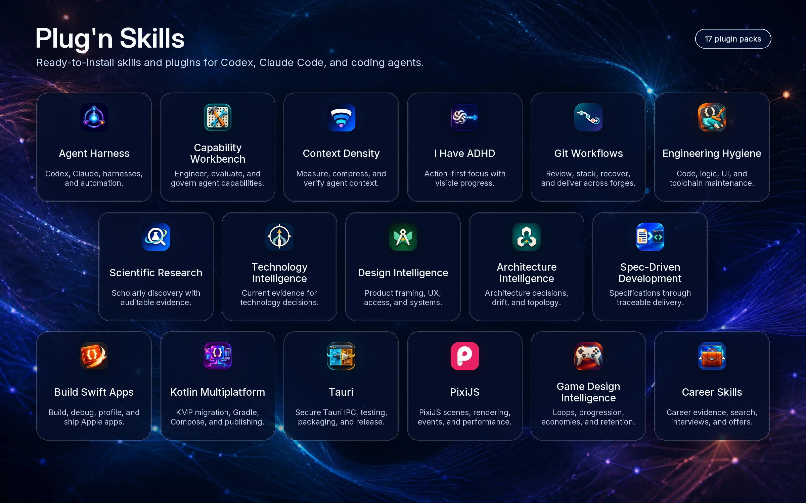

# Plug'n Skills

Ready-to-install skills and plugins that make coding agents better at real
development work.

Plug'n Skills is a library of plugin packs for Codex, Claude Code, Cursor, and
other coding agents. The source tree is agent-agnostic: every pack works from
any of those hosts and is never locked to one of them. Each pack gives an
agent a focused workflow: what to inspect, which
commands to run, what to verify, and when to use a deterministic helper instead
of improvising from a prompt.

Use it when you want an agent to handle more than generic code edits:

- build, debug, profile, test, package, and release Swift apps;
- operate Codex, Claude Code, agent harnesses, schedulers, and Git workflows;
- work with Kotlin Multiplatform, Tauri, PixiJS, and Apple platforms;
- review architecture, product direction, interface quality, and game systems;
- plan scientific research, spec-driven delivery, context compression, and
  agent capability synthesis.

The repository ships 15 installable plugin packs and 150+ focused agent
skills, all plain repository content: manifests, `SKILL.md` files, references,
validators, and helper scripts. Inspect it, validate it from a fresh clone,
install only the packs you need, and keep generated local marketplace or cache
state out of the repo.

## Quick Start

### Easiest: Ask Your Agent

Paste this prompt into the coding agent you already use:

```text
Install Plug'n Skills from https://github.com/Xopoko/plug-n-skills on this
computer. Follow the repository instructions for the coding agent you are
running in, validate the source tree first, use a dry run before writing global
plugin state, install only the plugin packs I request unless I ask for all of
them, and report exactly what was changed.
```

### Clone And Validate

```bash
git clone https://github.com/Xopoko/plug-n-skills.git
cd plug-n-skills
python3 scripts/validate-repository.py
```

### Codex

Preview the Codex install plan before writing global state:

```bash
python3 scripts/install-codex-plugins.py --dry-run
```

Install or refresh every plugin from this checkout:

```bash
python3 scripts/install-codex-plugins.py
python3 scripts/install-codex-plugins.py --check-only
```

Install only selected plugin packs:

```bash
python3 scripts/install-codex-plugins.py --plugin capability-workbench
python3 scripts/install-codex-plugins.py \
  --plugin kotlin-multiplatform \
  --plugin spec-driven-development
```

Exclude plugin packs that are not useful on the current host:

```bash
python3 scripts/install-codex-plugins.py \
  --exclude-plugin build-swift-apps \
  --exclude-plugin kotlin-multiplatform
```

The installer validates the repository, generates a local Codex marketplace
file at `.agents/plugins/marketplace.json`, points Codex's `local` marketplace
at this checkout, enables the selected plugins, and materializes cache entries
under the active Codex home: `$CODEX_HOME` when it is nonempty, otherwise
`~/.codex`. A configured `CODEX_HOME` must resolve to an existing directory.
Explicit `--config-path` and `--cache-root` values take precedence.

If the canonical checkout removes a repo-owned plugin, an install write retires
only its standard missing `./plugins/<name>` entry from the generated local
marketplace. Custom entries are preserved. Enabled config, cache, or copied
source residuals are reported and require the host's explicit uninstall or
disable lifecycle.

`.agents/` and Codex cache directories are local runtime state, not part of
the published source tree.

### Claude Code

Add this repository as a Claude Code marketplace, then install the pack you
need:

```text
/plugin marketplace add Xopoko/plug-n-skills
/plugin install capability-workbench@xopoko-plug-n-skills
/reload-plugins
```

For a local checkout, use its path instead of the GitHub shorthand:

```text
/plugin marketplace add /path/to/plug-n-skills
```

Claude Code reads the root `.claude-plugin/marketplace.json` and each plugin's
`.claude-plugin/plugin.json`.

### Cursor

Cursor consumes `SKILL.md` folders directly and has no plugin marketplace.
Install (or refresh) the repository skills into Cursor's global skills
directory:

```bash
python3 scripts/install-cursor-skills.py --dry-run
python3 scripts/install-cursor-skills.py
python3 scripts/install-cursor-skills.py --check-only
```

Use repeated `--plugin` or `--exclude-plugin` flags when a host should only see
part of the repository.

The installer is idempotent: unchanged skills are skipped, drifted skills are
replaced to match the repository source, and repeated runs converge.

## Included Plugin Packs

| Plugin | Use it for |
| --- | --- |
| `agent-harness` | Agent harness design and evaluation; Codex and Claude Code operations, automation, diagnostics, MCP, hooks, sessions, deferred completion, and local scheduler proof. |
| `capability-workbench` | Capability discovery, synthesis, portfolio design, skill/plugin and agent-guidance authoring, trigger metadata, cross-runtime catalog and evidence-coverage audits, vetting, repair, icon workflows, and explicit install/cache checks. |
| `context-density` | Context design, long-context placement, typed state and companion-drift validation, research-backed acceptance gates, prompt contracts, skill compression, structural handoff, and validation reporting. |
| `git-workflows` | Capability-bound read-only GitHub/GitLab code review, race-safe GitLab review response, stacked change delivery, worktree recovery, and SSH commit-signing recovery across eligible MCP, connector, CLI, and API adapters. |
| `engineering-hygiene` | Touched-surface code maintenance, business-logic untangling, rendered UI inspection, and evidence-first missing-tool provisioning. |
| `scientific-research` | Scholarly discovery, deduplication, source routing, claim ledgers, provenance, and evidence quality gates. |
| `technology-intelligence` | Dated, source-backed technology adoption, trial, replacement, and delivery-mode decisions with explicit context, alternatives, confidence, and evidence freshness. |
| `design-intelligence` | Product framing, interface architecture, interaction design, visual hierarchy, accessibility, and design-system governance. |
| `architecture-intelligence` | Source-backed architecture audits, async state consistency, ownership and runtime topology, module boundaries, ADRs, fitness functions, conformance checks, and refactoring strategy. |
| `spec-driven-development` | Spec-driven workflows with lane selection, Spec Kit integration, requirements quality, traceability, implementation, and proof gates. |
| `build-swift-apps` | Building, debugging, profiling, testing, packaging, and releasing Swift apps across iOS and macOS. |
| `kotlin-multiplatform` | Kotlin Multiplatform architecture, Gradle diagnosis, Compose Multiplatform, iOS interop, testing, security, publishing, and production readiness. |
| `tauri` | Tauri 2 setup, migration, configuration security, IPC, plugins, shell UI, debugging, testing, distribution, and mobile workflows. |
| `pixijs` | PixiJS v8 application setup, scene graph, rendering, assets, events, filters, migration, and performance. |
| `game-design-intelligence` | Gameplay loops, systems, progression, economies, motivation, retention, onboarding, difficulty, multiplayer, and live-service critique. |

See [plugins/README.md](plugins/README.md) for the per-plugin source index and
manifest identifiers.

The former `gitlab-review`, `stacked-delivery`, and `git-worktree-safety`
packages are consolidated into `git-workflows`. The Codex and Cursor installers
accept any of those legacy names as an alias for the consolidated package.
When `git-workflows` is selected, the Codex installer replaces legacy local
marketplace entries and reports any old enabled config, cache, or copied-source
residuals without deleting them. Verify the consolidated plugin first, then use
the host's explicit uninstall or disable lifecycle for every reported old ID.

Claude Code has no repository-defined plugin alias. Install the new ID, remove
each old ID at the same install scope, then reload plugins:

```text
/plugin install git-workflows@xopoko-plug-n-skills
/plugin uninstall gitlab-review@xopoko-plug-n-skills
/plugin uninstall stacked-delivery@xopoko-plug-n-skills
/plugin uninstall git-worktree-safety@xopoko-plug-n-skills
/reload-plugins
```

Source validation never mutates installed host state.

The former `codex-cli`, `claude-code`, and `scheduled-automation` packages are
consolidated into `agent-harness`. Their focused skill names remain available
inside the new package. `agent-harness-engineering` and
`agent-harness-evaluation` also moved there from Capability Workbench; install
both packs when you need capability authoring and runtime harness work. The
repository's Codex and Cursor helpers accept any old package name as an alias
for `agent-harness`; host plugin runtimes do not.
A targeted Codex install migrates only the matching local marketplace entries
and reports, but never deletes, old config, cache, or copied-source residuals.

Claude Code requires an explicit same-scope migration:

```text
/plugin install agent-harness@xopoko-plug-n-skills
/plugin uninstall codex-cli@xopoko-plug-n-skills
/plugin uninstall claude-code@xopoko-plug-n-skills
/plugin uninstall scheduled-automation@xopoko-plug-n-skills
/reload-plugins
```

Verify `agent-harness` before disabling or uninstalling an old package.

## Token Efficiency

This collection is designed around progressive disclosure. Agents can
route from lightweight metadata first, then load the selected
`SKILL.md` body only for the chosen workflow.

These estimates are generated with `scripts/token-report.py` using
`tiktoken` and the `o200k_base` encoding. Different agents may
wrap metadata differently, so the exact number is less important than
the split between always-visible routing metadata and on-demand skill
instructions.

| Metric | Count | Tokens | Notes |
| --- | ---: | ---: | --- |
| Plugin packs | 15 | - | Installable packages under `plugins/`. |
| Skill entrypoints | 176 | - | `SKILL.md` files exposed through plugin metadata. |
| Reference files | 253 | - | Longer ledgers, contracts, scorecards, and source notes. |
| Helper and validator scripts | 90 | - | Deterministic plugin-local helpers. |
| Startup metadata | 176 skills | 12,751 | Skill name, description, and file pointer for routing. |
| On-demand skill bodies | 176 skills | 130,214 | Instruction bodies after frontmatter, loaded only when selected. |

Regenerate the report after skill edits:

```bash
python3 scripts/token-report.py
```

### Plugin Token Rollup

Descriptions are split from the numeric rollup so GitHub does not
compress long prose into narrow table cells.

Token columns are `startup metadata / on-demand body`.

| Plugin | Skills | Refs | Scripts | Startup | Body |
| --- | ---: | ---: | ---: | ---: | ---: |
| `agent-harness` | 18 | 18 | 6 | 1,385 | 19,194 |
| `capability-workbench` | 10 | 16 | 23 | 731 | 13,608 |
| `context-density` | 1 | 9 | 8 | 70 | 2,806 |
| `git-workflows` | 5 | 10 | 6 | 416 | 7,339 |
| `engineering-hygiene` | 4 | 3 | 0 | 319 | 3,239 |
| `scientific-research` | 1 | 4 | 1 | 84 | 2,024 |
| `technology-intelligence` | 2 | 5 | 1 | 143 | 1,057 |
| `design-intelligence` | 7 | 2 | 1 | 455 | 5,399 |
| `architecture-intelligence` | 9 | 8 | 2 | 579 | 7,585 |
| `spec-driven-development` | 6 | 0 | 2 | 318 | 3,267 |
| `build-swift-apps` | 61 | 90 | 36 | 4,423 | 36,116 |
| `kotlin-multiplatform` | 14 | 22 | 2 | 1,101 | 14,462 |
| `tauri` | 6 | 0 | 1 | 438 | 3,235 |
| `pixijs` | 26 | 64 | 0 | 1,837 | 7,967 |
| `game-design-intelligence` | 6 | 2 | 1 | 452 | 2,916 |

### Plugin Focus

| Plugin | Description |
| --- | --- |
| `agent-harness` | Agent harness design and evaluation plus Codex CLI, Claude Code, MCP, hooks, sessions, deferred completion, and local scheduler proof. |
| `capability-workbench` | Design, audit, synthesize, package, install, repair, and reshape agent skills and plugins with trigger metadata, catalog analysis, guidance authoring, vetting, and validation. |
| `context-density` | Agent context audits measure token cost, validate prompt/output contracts and typed state, test compression, and route structural skill or plugin overlap to Capability Workbench. |
| `git-workflows` | Git code review, GitLab discussion response, stacked-change delivery, worktree recovery, and SSH commit-signing recovery use exact-state, capability-selected, fail-closed workflows. |
| `engineering-hygiene` | Engineering hygiene audits changed code, untangles business logic, inspects rendered UI, and provisions missing tools with evidence-first, touched-surface discipline. |
| `scientific-research` | Scholarly research discovers papers, deduplicates DOIs, extracts source-backed claims, and validates evidence across arXiv, OpenAlex, Crossref, Europe PMC, Semantic Scholar, PubMed, and OpenCitations. |
| `technology-intelligence` | Evidence-backed technology decisions compare frameworks, platforms, infrastructure, and CLI/MCP/API delivery modes with dated primary-source observations, explicit gaps, staleness checks, and review-gated refreshes. |
| `design-intelligence` | Product and UX design judgment grounded in evidence: framing, information architecture, interaction, usability/accessibility review, visual communication, and design-system governance; excludes Figma, CSS, and framework recipes. |
| `architecture-intelligence` | Software architecture audits and decisions grounded in source evidence: boundaries, ownership/runtime topology, async state consistency, conformance, ADRs, fitness functions, and staged refactoring. |
| `spec-driven-development` | Spec-Driven Development routes intent through specs, plans, traceable tasks, implementation, and proof. |
| `build-swift-apps` | Build, debug, profile, test, refactor, and release Swift apps across iOS, macOS, Xcode, SwiftUI, SwiftPM, Tuist, and App Store Connect. |
| `kotlin-multiplatform` | Kotlin Multiplatform design, Gradle repair, Compose UI, data/interop architecture, migration, testing, governance, security, performance, CI, publishing, and readiness review. |
| `tauri` | Tauri 2 project scaffolding/migration, security, Rust IPC/plugins, shell UI, debugging, testing, packaging, signing, updates, and desktop/mobile release. |
| `pixijs` | PixiJS v8 scene tooling builds and debugs Applications, assets, events, filters, shaders, performance, v7 migrations, and create-pixi projects. |
| `game-design-intelligence` | Game design judgment grounded in evidence: core loops, gameplay systems, progression/economy/balance, motivation/retention, onboarding/difficulty, and multiplayer/live-service health; excludes engines, graphics, assets, and code. |

### Skill Token Index

Token cells are shown as `startup/body`.

#### `agent-harness`

| Skill | Tokens | Description |
| --- | ---: | --- |
| `agent-harness` | 82/452 | Agent harnesses and Codex/Claude runtimes: route design/evaluation, Codex CLI, Claude Code, MCP, hooks, sessions, deferred completion, and scheduler proof. Excludes skill/plugin authoring (Capability Workbench) and generic app architecture. |
| `agent-harness-engineering` | 82/1,176 | Design LLM agent harnesses with typed control loops, tools/state, context/memory, policy, cancellation, recovery, and delegation. Excludes prompt-only, generic app architecture, vendor CLI/config, evaluation-only work, and skill creation. |
| `agent-harness-evaluation` | 76/1,194 | Evaluate LLM agent harness reliability through replay, regression, failure/restart, cancellation, context pressure, and release gates. Excludes generic tests, surveys, prompt/model-only benchmarks, and design without empirical evidence. |
| `claude-agent-worktrees` | 84/756 | Claude Code sessions coordinate background agents, `claude agents --json`, dispatched-session defaults, worktrees, tmux/iTerm panes, resume/continue/from-pr/fork-session, names and IDs, remote control, and cloud ultrareview runs. |
| `claude-code` | 69/791 | Claude Code CLI routes local inspection, interactive or print-mode automation, plugin and MCP lifecycle, diagnostics, hooks/settings, background agents, worktrees, sessions, remote control, and ultrareview. |
| `claude-doctor-debugger` | 83/740 | Claude Code diagnostics isolate install, update, auth, configuration health, broken customizations, safe/bare modes, debug logs, auto-mode, keychain/API-key boundaries, IDE/Chrome integration, doctor warnings, and setup-token failures. |
| `claude-hooks-settings` | 78/708 | Claude Code settings and hooks are created, audited, or debugged across CLAUDE.md/rules loading, custom agents, tool permissions, output styles, workflows, setting sources, safe/bare modes, and plugin customizations. |
| `claude-plugin-mcp-manager` | 78/838 | Claude Code plugins and MCP servers are managed across marketplaces, validation, token cost, install/update/remove/prune, session-only sources, MCP approvals, strict config, transports, headers, OAuth, and lifecycle failures. |
| `claude-print-automation` | 79/840 | Claude Code print-mode runs are prepared or debugged with `claude --print`, text/JSON/stream-json I/O, JSON Schema, budgets, fallback models, no persistence, prompt suggestions, and trusted-directory CI. |
| `codex-cli` | 71/1,131 | Route Codex CLI operations across skill-catalog diagnostics, CLI inspection, exec/review automation, deferred completion, task supervision, plugin/MCP management, doctor/debug, rollout forensics, and app environments. |
| `codex-deferred-completion` | 62/1,031 | Complete long-running executable work through an existing atomic JSON terminal receipt, avoiding repeated native-session or remote-status polling and wasted model turns. |
| `codex-doctor-debugger` | 88/1,084 | Diagnose current Codex CLI health and model-visible skill catalogs: metadata truncation/omission, install, config, auth, sandbox, prompt, app-server, remote-control, and runtime failures. For what an existing task saw, use codex-log-reader. |
| `codex-environments` | 72/995 | Manage Codex app project environments and actions in `.codex/environments/environment.toml`, including Run/Test/Preview buttons, startup commands, launchers, environment variables, and repeatable local commands. |
| `codex-exec-automation` | 78/1,018 | Automate non-interactive Codex CLI runs with `codex exec`, resume, review, JSONL events, output schemas, last-message files, cwd/profile/config, sandbox/approval modes, and CI. |
| `codex-log-reader` | 73/1,279 | Inspect Codex rollout JSONL by CODEX_THREAD_ID, cwd, query, issue, project, lineage, malformed or large logs, permission concerns, and "what happened in this task?" forensics. |
| `codex-plugin-mcp-manager` | 69/1,049 | Manage Codex plugins, local marketplaces, cache visibility, and MCP server list/get/add/remove/login/logout, bearer-token environment bindings, and plugin/MCP installation failures. |
| `codex-thread-supervisor` | 83/2,954 | Supervise live Codex tasks by ID with cursor waits, attention/completion gates, bounded claims, checkpoints, skill/evidence handoffs, and privacy-safe capability mining. Excludes rollout forensics, current-turn subagents, and external jobs. |
| `scheduled-automation-runtime` | 78/1,158 | Local scheduler jobs need proof when launchd, systemd, cron, or Windows Task Scheduler differ from manual runs or lack runtime proof. Not for vendor CLI command construction, architecture inventory, cloud schedulers, or job business logic. |

#### `capability-workbench`

| Skill | Tokens | Description |
| --- | ---: | --- |
| `agent-guidance-factory` | 79/678 | Author repository agent guidance such as AGENTS.md, CLAUDE.md, and scoped rules for load order, nested instructions, migration, audits, or stale-doc cleanup. Excludes ordinary human docs unless agents consume them. |
| `capability-auditor` | 77/1,709 | Audit agent skills/plugins for safety, evidence coverage, duplication, context cost, prompt contracts, dependencies, and install risk. Excludes code line/branch/mutation/test coverage; use portfolio architect for structural changes. |
| `capability-portfolio-architect` | 76/947 | Reshape skill/plugin portfolios when routing overlaps, capabilities duplicate or disappear, or split/merge/move/delete/router/reference/script boundaries need decisions. Use capability-auditor for single-artifact quality. |
| `capability-reality-repair` | 73/836 | Repair stale or false skill/script/plugin/MCP contracts when commands, schemas, paths, outputs, dependencies, install state, connector guidance, validators, or docs disagree with live reality. |
| `capability-synthesizer` | 68/2,228 | Synthesize or strengthen well-vetted agent skills/plugins from broad public sources and local or user-provided candidates, with evidence-backed comparison and adoption/rejection. |
| `capability-workbench` | 72/1,998 | Route agent skill and plugin lifecycle work across discovery, synthesis, creation, installation, packaging, audit, portfolio design, trigger metadata, guidance authoring, and repair. Excludes runtime harness operations. |
| `plugin-factory` | 68/1,489 | Build or update marketplace-backed agent plugins with manifests, skill bundles, local marketplace entries, packaging, validation, optional install/cache gates, runtime-discovery status, and Codex deeplinks. |
| `skill-factory` | 72/1,468 | Create or refactor portable agent skills across SKILL.md bodies, progressive disclosure, scripts/references/assets, packaging, and validation. For name/description-only routing work, use skill-trigger-metadata first. |
| `skill-installer-vetter` | 72/942 | Find, compare, vet, install, or update agent skills from catalogs, GitHub, local folders, or user references with provenance, safety, dependency, capability, and destination checks. |
| `skill-trigger-metadata` | 74/1,313 | Optimize skill names/descriptions for reliable routing under catalog truncation, omission, and cross-runtime pressure. For instruction, resource, packaging, or installation changes, continue with skill-factory or plugin-factory. |

#### `context-density`

| Skill | Tokens | Description |
| --- | ---: | --- |
| `context-density` | 70/2,806 | Agent context audits measure token cost, provenance, compression, typed-state drift, trigger overlap, and prompt/output contracts across AGENTS.md, prompts, skills, plugins, MCP/tool schemas, current-state artifacts, and agent handoffs. |

#### `git-workflows`

| Skill | Tokens | Description |
| --- | ---: | --- |
| `forge-code-review` | 82/1,085 | Read-only review for GitHub PR or GitLab MR links through a probed MCP, connector, CLI, or REST adapter. Binds exact head and complete discussions; never posts, approves, resolves, merges, pushes, edits, or performs broad repository audits. |
| `git-commit-signing-recovery` | 88/1,455 | Recover a Git commit that failed before ref advancement due to an SSH signer, agent, socket, or helper. Preserves staged state for one verified retry. Excludes hooks, conflicts, remote auth, non-SSH signing, and amend/merge/rebase. |
| `git-worktree-recovery` | 81/1,014 | Recover a missing/stale/broken Git worktree path or symlink when a registered replacement holds the branch. Audits retention and guards POSIX-only repair. Excludes worktree administration, ref restoration, restacking, and unsaved content. |
| `gitlab-review-response` | 81/1,624 | GitLab MR discussions: address feedback, bind pushes to source project/SHA, prove exact-head CI, and reply idempotently. Per-thread resolution needs authorization. Excludes broad review, GitHub PRs, approvals, merges, and bulk resolution. |
| `stacked-change-delivery` | 84/2,161 | Stacked PR/MR delivery binds children to exact parent heads, restacks after changes, records CI proof, lands bottom-up/atomically, and hands off safely. Excludes independent changes, review replies, and automatic merge/force-push authority. |

#### `engineering-hygiene`

| Skill | Tokens | Description |
| --- | ---: | --- |
| `code-maintenance-audit` | 73/908 | Changed-code audits find dead or unused symbols, stale leftovers, duplicate logic, obsolete tests, and consolidation before completion. Not for speculative architecture, style churn, or performance optimization unless explicitly requested. |
| `provisioning-missing-tools` | 89/678 | Missing toolchains are provisioned when absent, outdated, weak, or misconfigured commands, SDKs, runtimes, package managers, drivers, CLIs, simulators, emulators, or test/profiling utilities block or downgrade end-to-end work. |
| `ui-visual-audit` | 79/835 | Rendered UI and screenshot audits verify changes and catch unrelated occlusion, clipping, overlap, broken icons, poor contrast, spacing/alignment, platform-control, data-plausibility, responsive text, and visible accessibility defects. |
| `untangle-business-logic` | 78/818 | Business-logic refactors separate rules from UI/IO/platform/concurrency/lifecycle, state, and error policy while preserving behavior, targeting duplicated meaning and hidden invariants rather than dead-code cleanup or performance tuning. |

#### `scientific-research`

| Skill | Tokens | Description |
| --- | ---: | --- |
| `scientific-research` | 84/2,024 | Scholarly research discovers papers, builds traceable corpora, deduplicates DOIs, extracts source-backed claims, synthesizes evidence, and validates quality across arXiv, OpenAlex, Crossref, Europe PMC, Semantic Scholar, and PubMed. |

#### `technology-intelligence`

| Skill | Tokens | Description |
| --- | ---: | --- |
| `technology-advisor` | 70/601 | Compare software frameworks, databases, platforms, and CLI/MCP/API delivery modes for an explicit adoption or migration decision using dated evidence and constraints. Excludes routine coding and running or installing already-selected tools. |
| `technology-evidence-maintainer` | 73/456 | Validate, inspect, diff, or explicitly refresh Technology Intelligence evidence, provenance, staleness, rights, and coverage. Excludes stack selection, runtime discovery, installation, and automatic recommendation changes. |

#### `design-intelligence`

| Skill | Tokens | Description |
| --- | ---: | --- |
| `design-intelligence` | 64/852 | Product and UX design routing covers framing, information architecture, interaction, usability, accessibility, visual communication, and design-system governance; excludes Figma, CSS, automation, and assets. |
| `design-system-governance` | 67/764 | Design-system governance defines reusable patterns, contribution rules, accessibility evidence, ownership, maturity, adoption, and drift; excludes CSS, Figma libraries, and token tooling unless requested. |
| `interaction-design` | 60/768 | Interaction design shapes task flows, affordances, feedback, state coverage, error prevention, recovery, undo, progressive disclosure, input burden, and keyboard/touch behavior. |
| `interface-architecture` | 54/748 | Interface architecture structures navigation, taxonomy, labels, content models, screen priority, findability, search/browse, and information hierarchy. |
| `product-framing` | 63/505 | Product framing clarifies user needs, Jobs-to-be-Done, outcomes, strategy, assumptions, opportunity-solution trees, HEART/GSM metrics, and discovery before interface design. |
| `usability-accessibility-review` | 73/742 | Usability and accessibility review audits screens, flows, or specs for heuristics, cognitive-walkthrough risks, WCAG/APG/COGA concerns, inclusive design, ethical UX, and dark patterns. |
| `visual-communication` | 74/1,020 | Visual communication audits UI screenshots, golden images, and visual diffs for hierarchy, readability, contrast, capture state, and test-harness artifacts. Do not use for screenshot generation/export, CSS, Figma, or styling. |

#### `architecture-intelligence`

| Skill | Tokens | Description |
| --- | ---: | --- |
| `architecture-conformance` | 57/546 | Architecture conformance compares intended rules with implementation for dependencies, ADRs, ownership constraints, drift, erosion, recovered models, and classifications. |
| `architecture-decisions` | 55/383 | Architecture decisions record structural tradeoffs, consequences, reversibility, ownership, validation, and ADR revisit triggers; skip local choices. |
| `architecture-fitness-functions` | 62/625 | Architecture fitness functions turn intended boundaries into dependency rules, cycle checks, ownership gates, ADR conformance, runtime/resilience checks, and staged CI enforcement. |
| `architecture-intelligence` | 66/1,199 | Software architecture routing covers module boundaries, dependencies, runtime topology, async state, ownership, ADRs, fitness functions, and staged refactoring; excludes UI/UX and routine cleanup. |
| `architecture-ownership-topology` | 66/583 | Architecture ownership analysis maps CODEOWNERS/OWNERS coverage, ownerless modules, cross-owned dependencies, review paths, and governance risk without inferring team health. |
| `architecture-refactoring-strategy` | 64/517 | Architecture refactoring strategy stages boundary extraction, modularization, dependency inversion, migrations, anti-corruption layers, validation, and rollback instead of rewrites. |
| `architecture-runtime-topology` | 63/579 | Runtime architecture analysis maps services, app/CLI/background flows, deployment/IaC, integrations, observability, resilience, and coupling without claiming production truth. |
| `async-state-consistency` | 79/2,314 | Asynchronous state consistency: cache races, subscriber notifications, memoized/coalesced loads, replay, one-shot reads, invalidation, stale results. Excludes UI-only display, deployment topology, distributed consensus, unrelated flakiness. |
| `codebase-architecture-audit` | 67/839 | Codebase architecture audits recover actual modules, dependencies, domain seams, runtime coupling, ownership, quality attributes, tests, docs, and risks before structural code changes. |

#### `spec-driven-development`

| Skill | Tokens | Description |
| --- | ---: | --- |
| `sdd` | 57/760 | Spec-Driven Development routes lightweight, Spec Kit, Kiro-style, OpenSpec-style, brownfield, bugfix, planning, implementation, and audit lanes. |
| `sdd-audit` | 49/411 | SDD artifact audits verify traceability, surface selection, and completion evidence before implementation or final delivery. |
| `sdd-implement` | 55/511 | SDD task execution: execute approved tasks, update status, handle spec drift, and require fresh completion evidence before any done claim. |
| `sdd-plan-tasks` | 51/513 | SDD plans convert approved specs into designs, contracts, quickstarts, and traceable task lists. |
| `sdd-spec-kit` | 54/574 | GitHub Spec Kit projects route constitution, specify, clarify, plan, tasks, analyze, implement, extensions, and presets. |
| `sdd-specify` | 52/498 | SDD specifications capture requirements, assumptions, non-goals, acceptance criteria, success metrics, and retrofit truth markers. |

#### `build-swift-apps`

| Skill | Tokens | Description |
| --- | ---: | --- |
| `app-icon-studio` | 69/984 | Apple app icons: create, generate, evaluate, export, install, or debug iOS AppIcon.appiconset and macOS .icns assets for small-size clarity. |
| `apple-dev-research` | 66/503 | Apple developer articles: search Swift, SwiftUI, Xcode, iOS, and macOS community blogs, tutorials, and write-ups, not official docs. |
| `apple-firmware-inspector` | 79/676 | Apple firmware: inspect and reverse-engineer IPSWs, kernelcaches, dyld shared caches, private headers, entitlements, Mach-O binaries, KEXTs, and security internals with `ipsw`. |
| `appstore-ads-operator` | 69/843 | Apple Ads campaigns: inspect and manage separate auth, orgs, ad groups, creatives, keywords, reports, and API calls; approve live mutations first. |
| `appstore-archive-uploader` | 72/800 | App Store IPA/PKG archives: set version/build numbers, archive, export, upload, or publish with `asc xcode` before TestFlight/App Store submission. |
| `appstore-aso-auditor` | 72/687 | App Store ASO audit: analyze canonical `./metadata` offline after `asc metadata pull`; add Astro MCP keyword gaps and Apple app-tag context when available. |
| `appstore-build-monitor` | 61/334 | App Store builds: track processing, find latest builds and next numbers, wait on uploads, or safely expire old builds with `asc`. |
| `appstore-connect-cli` | 64/521 | App Store Connect commands: discover and run `asc` CLI auth, schemas, canonical verbs, pagination, output, Apple Ads, and timeouts. |
| `appstore-crash-insights` | 64/494 | TestFlight crash reports: triage crashes, beta feedback, hangs, disk writes, launches, and performance diagnostics with `asc`. |
| `appstore-id-resolver` | 65/318 | App Store Connect IDs: resolve apps, builds, versions, groups, testers, and review submissions from names with deterministic `asc` lookups. |
| `appstore-metadata-localizer` | 83/425 | App Store listing text: translate and market-adapt descriptions, keywords, What's New, names, subtitles, and privacy text across locales. Excludes non-translation edits, standalone release notes, and IAP/subscription names. |
| `appstore-metadata-sync` | 81/436 | App Store metadata JSON: edit, validate, push, or sync canonical `./metadata`, plus legacy fastlane migration via `asc migrate`. Excludes translation-first work, standalone release notes, and IAP/subscription names. |
| `appstore-notary-runner` | 75/485 | macOS Developer ID notarization commands for xcodebuild export, `asc notarization` submit/status/log, and stapling. Excludes packaging-readiness reviews and signing-only diagnosis. |
| `appstore-pricing-planner` | 74/402 | App Store subscription and IAP pricing by territory with `asc`, including price points, PPP/localized CSV imports, availability, summaries, and schedules; mutating actions require confirmation. |
| `appstore-record-creator` | 66/570 | App Store Connect New App creation via visible browser automation after bundle-ID registration for the API-less web form; never store cookies or auto-retry Create. |
| `appstore-release-director` | 75/726 | iOS App Store release orchestration from a local repo through signing, metadata, privacy, screenshots, upload, TestFlight, review submission/resubmission, blocker triage, and release evidence. |
| `appstore-release-notes-writer` | 77/688 | App Store What's New notes and promotional text from git history, bullets, or prose, with optional localization. Excludes full-listing translation, metadata sync, and subscription/IAP names. |
| `appstore-release-planner` | 76/722 | App Store release go/no-go planning for readiness, first-submission blockers, sequencing, and stage-versus-submit decisions. Routes execution to focused skills; review commands belong to appstore-review-readiness. |
| `appstore-revenuecat-sync` | 78/784 | App Store Connect and RevenueCat subscription/IAP reconciliation with `asc` and RevenueCat MCP for catalog bootstrap, drift audits, deterministic product/entitlement/offering/package mapping, and no deletions. |
| `appstore-review-readiness` | 81/440 | App Store review-readiness execution with current `asc` commands to validate, stage, submit, monitor, cancel, or repair blockers after go/no-go planning. Excludes release strategy; appstore-release-planner owns it. |
| `appstore-screenshot-pipeline` | 71/1,013 | iOS App Store screenshot automation with xcodebuild/simctl capture, AXe plans, Koubou framing, review artifacts, and `asc` upload. |
| `appstore-screenshot-studio` | 70/653 | App Store marketing screenshot creation and revision to translate, scrape, crop, and validate `.appstore-screenshots` workspaces. Excludes general image generation. |
| `appstore-screenshot-validator` | 68/420 | App Store screenshot validation and upload with live `asc` size data and macOS `sips` to resize, strip alpha, and color-convert copies. |
| `appstore-signing-setup` | 67/646 | App Store signing asset setup with `asc` for bundle IDs, capabilities, certificates, profiles, local install, rotation, and encrypted team sync. |
| `appstore-subscription-localizer` | 79/402 | App Store subscription localization: create or update localized display names and descriptions for groups, subscriptions, and IAPs with `asc`; exclude app listing metadata, release notes, keywords, screenshots, and pricing. |
| `appstore-testflight-coordinator` | 62/346 | Coordinate TestFlight beta distribution, groups, testers, and What to Test notes with `asc` for beta rollouts. |
| `appstore-wall-publisher` | 70/373 | Submit or update Wall of Apps entries in the App-Store-Connect-CLI repository with `asc apps wall submit`; match wall submission, addition, or update requests. |
| `appstore-workflow-runner` | 73/793 | Manage `.asc/workflow.json` automations; define, validate, run, resume, and audit trusted repo-local release/TestFlight flows and step outputs with `asc workflow`. |
| `build-swift-apps` | 91/758 | Route broad or ambiguous Swift and Apple-platform work to a focused skill; this router does not implement domain work. Covers iOS, macOS, SwiftUI, Xcode, Simulator, App Store Connect, Tuist, SwiftPM, signing, profiling, and Apple research. |
| `ios-ettrace-profiler` | 66/1,034 | iOS ETTrace Simulator profiles: capture and interpret symbolicated startup, scrolling, navigation, rendering, CPU hotspots, and before/after evidence. |
| `ios-intents-architect` | 74/556 | Design and implement iOS App Intents, AppEntity, EntityQuery, and App Shortcuts for Siri, Spotlight, widgets, controls, Shortcuts, and app handoff routes. |
| `ios-liquid-glass-designer` | 79/452 | Implement, refactor, or review iOS 26+ SwiftUI Liquid Glass with native `glassEffect`, `GlassEffectContainer`, button styles, availability gates, and non-glass fallbacks. |
| `ios-memgraph-inspector` | 74/581 | iOS memgraph leak analysis: capture, inspect, compare, and prove memory leaks with Apple's `leaks` tool, retain-cycle evidence, and before/after checks. |
| `ios-rocketsim-operator` | 63/486 | RocketSim iOS Simulator UI: inspect and control accessibility state, gestures, typing, hardware buttons, and CLI automation. |
| `ios-simulator-browser` | 72/805 | Mirror iOS Simulator runs in the Codex browser for interaction, visible proof, and hot-reloaded SwiftUI previews from importable Swift packages; exclude headless or log-only debugging. |
| `ios-simulator-debugger` | 80/532 | Debug iOS Simulator apps with XcodeBuildMCP for build, run, launch, UI inspection, interaction, screenshots, and logs; route user-visible mirrors and SwiftUI previews to `ios-simulator-browser`. |
| `ios-swiftui-architect` | 75/708 | iOS SwiftUI views and components: build or refactor navigation, state ownership, async UI, sheets, previews, and responsive layouts; exclude UIKit-only and macOS work. |
| `macos-appkit-bridge` | 78/566 | macOS SwiftUI-AppKit bridges: implement NSViewRepresentable, NSViewControllerRepresentable, NSWindow, panels, responder chains, or menus only where pure SwiftUI cannot model the behavior. |
| `macos-liquid-glass-designer` | 74/593 | macOS SwiftUI Liquid Glass UI: modernize or review system materials, toolbars, search, controls, and custom glass; prefer native structure over hand-built chrome. |
| `macos-notarization-packager` | 78/341 | macOS distribution artifacts: inspect Developer ID archives, app bundles, hardened runtime, nested signing, and notarization readiness; exclude local signing-only diagnosis and direct `asc notarization` execution. |
| `macos-runtime-debugger` | 81/770 | macOS app runtimes: build, launch, and debug Xcode or SwiftPM GUI/CLI targets with shell-first workflows; diagnose compiler, linker, startup, log, and telemetry failures; exclude iOS Simulator work. |
| `macos-signing-inspector` | 71/485 | macOS app signing artifacts: inspect code signatures, entitlements, hardened runtime, sandbox, Gatekeeper, and trust failures; exclude distribution packaging and notarization submission. |
| `macos-swiftpm-runner` | 80/280 | macOS SwiftPM packages: build, run, and test package-first repositories and executables when `Package.swift` is primary or no Xcode project exists; not for Xcode-only app bundles. |
| `macos-swiftui-architect` | 81/821 | macOS SwiftUI scenes: build or refactor windows, commands, toolbars, settings, split views, inspectors, menu bar extras, keyboard flows, and desktop layouts; not AppKit-only behavior. |
| `macos-telemetry-probe` | 68/412 | macOS runtime telemetry: add and verify privacy-safe Logger/OSLog events, log stream filters, and signposts; not crash diagnosis. |
| `macos-test-diagnoser` | 78/574 | macOS Xcode and SwiftPM tests: run focused scopes and diagnose build, assertion, crash, async-flake, fixture, entitlement, and host-app failures; separate regressions from setup issues. |
| `macos-view-architect` | 68/500 | macOS SwiftUI view structure: refactor oversized scenes into subviews, explicit roots, scoped state, command/toolbar ownership, and narrow AppKit bridges. |
| `macos-window-architect` | 76/799 | macOS 15+ SwiftUI windows: customize toolbar/title chrome, drag regions, materials, minimize/restoration, placement, launch behavior, and borderless styles; prefer SwiftUI before NSWindow. |
| `swiftpm-build-inspector` | 67/536 | Diagnose SwiftPM graph overhead across dependencies, plugins, module variants, branch pins, macros, binary targets, and slow CI or local Xcode builds. |
| `swiftui-performance-inspector` | 70/543 | Diagnose SwiftUI rendering and update costs from code or profiles when scrolling janks, CPU or memory spikes, views update excessively, layouts thrash, or apps hang. |
| `swiftui-view-architect` | 67/481 | Refactor oversized SwiftUI view files into stable, dedicated subviews with MV-first data flow, explicit dependencies, extracted actions, and correct Observation usage. |
| `tuist-flaky-test-stabilizer` | 72/554 | Stabilize flaky Tuist tests identified by test-insights URLs, test case IDs, or inconsistent local runs; covers test and product-code causes. |
| `tuist-generation-doctor` | 70/629 | Diagnose Tuist generation, build, and launch failures when `tuist generate`, generated Xcode workspaces, or apps fail or diverge from the source project. |
| `tuist-migration-planner` | 73/577 | Plan Xcode-to-Tuist migrations for hand-maintained projects, including target, setting, and dependency mapping plus generated build, test, signing, and launch parity. |
| `tuist-workspace-navigator` | 71/500 | Operate Tuist-generated Xcode workspaces with `tuist generate`, focused generation, tags, buildable folders, and post-generation build or test commands. |
| `xcode-build-baseline` | 65/623 | Benchmark Xcode clean, cached-clean, zero-change, and incremental builds with fixed inputs, timing summaries, and `.build-benchmark/` artifacts. |
| `xcode-build-strategist` | 68/959 | Coordinate end-to-end Xcode build optimization audits with recommend-first, approval-gated fixes, specialist analysis, wall-clock priorities, and re-benchmark proof. |
| `xcode-build-tuner` | 68/749 | Implement approved Xcode build-speed fixes after strategist approval or explicit requests covering build settings, script phases, Swift compilation, or SwiftPM graphs; re-benchmark results. |
| `xcode-compile-profiler` | 70/494 | Profile Swift and mixed-language compile bottlenecks from timing summaries, frontend diagnostics, type-check warnings, CompileSwiftSources, and SwiftEmitModule; recommend changes only. |
| `xcode-project-auditor` | 66/483 | Audit Xcode project and target overhead across schemes, settings, dependencies, run scripts, module maps, and explicit modules; require approval before changes. |
| `xcode-ui-test-stabilizer` | 82/451 | Build and stabilize Xcode UI end-to-end tests with XCUIApplication/xcodebuild for new or unreliable automation, covering environment setup, focus/input reliability, waits, logs, attachments, and flakiness triage. |

#### `kotlin-multiplatform`

| Skill | Tokens | Description |
| --- | ---: | --- |
| `kmp-architecture` | 68/932 | Kotlin Multiplatform architecture design for module boundaries, source-set hierarchies, shared logic versus UI, platform APIs, interop seams, and cross-platform library fit. |
| `kmp-compose-ui` | 68/1,242 | Compose Multiplatform UI implementation and repair across state, navigation, external-URI effects, resources, platform entry points, previews, accessibility, performance, and UI testing. |
| `kmp-data-layer` | 81/2,178 | KMP data-layer design/review for repositories, source-of-truth, migrations, DTO/domain mapping, offline sync, storage/errors, shared/coalesced work, cancellation and admission races, causal receipts, threading, and API exposure. |
| `kmp-ecosystem-selection` | 81/400 | Kotlin Multiplatform ecosystem selection for libraries/tools spanning persistence, networking, DI, navigation, logging, observability, testing, code quality, resources, images, docs, payments, and templates without imposing one stack. |
| `kmp-gradle-doctor` | 80/1,904 | Kotlin Multiplatform Gradle diagnosis and repair for source sets, dependency failures including private dependency resolution or consumption failures, Android targets, Compose, KGP/AGP, tests, static analysis, and CI. |
| `kmp-interop-bridges` | 90/581 | KMP platform-bridge design/review for source-set placement, expect/actual, entry-point wiring, cinterop, Swift API readiness, SKIE, KMP-NativeCoroutines, KDoctor, XCFrameworks, and SwiftPM export. |
| `kmp-migration-release` | 85/727 | Kotlin Multiplatform migration and release execution for AGP 9 Android-KMP adoption, monolithic composeApp splits, CocoaPods-to-SwiftPM moves, cinterop, iOS frameworks, CI, publishing, and app-store readiness. |
| `kmp-performance-observability` | 77/461 | Kotlin Multiplatform performance and observability diagnosis across Gradle build time, Kotlin/Native memory/GC, Compose jank, binary size, startup, runtime logging, and release-mode verification. |
| `kmp-production-governance` | 76/681 | Kotlin Multiplatform build-governance review for convention plugins, version catalogs, repository policy, module APIs, Klibs targets, ABI validation, publishing, production readiness, and adoption risk. |
| `kmp-production-readiness` | 74/416 | Kotlin Multiplatform production-readiness audits with scorecards, release blockers, risk ownership, and deferred checks across architecture, build, testing, interop, security, performance, and publishing. |
| `kmp-publishing-ci` | 78/510 | Kotlin Multiplatform CI and publishing design for Maven publications, Gradle metadata, ABI validation, XCFrameworks, SwiftPM export, KMMBridge, artifact hosting, signing boundaries, and app release gates. |
| `kmp-security-privacy` | 75/326 | Kotlin Multiplatform security and privacy review for secure storage, token handling, Ktor auth, TLS and pinning, log redaction, runtime protection, platform APIs, and commonMain boundaries. |
| `kmp-testing-quality` | 81/2,366 | KMP testing covers diagnosing KMP test failures, especially DI fixture or container missing bindings, plus commonTest, kotlin.test, platform/Compose UI and screenshot tests, test doubles, refactor safety, review gates, and regressions. |
| `kotlin-multiplatform` | 87/1,738 | Kotlin Multiplatform routing and execution across architecture, Gradle/private dependencies, Compose UI, Android-KMP migration, iOS interop, CocoaPods/SwiftPM moves, testing, performance, security, CI, publishing, and production readiness. |

#### `tauri`

| Skill | Tokens | Description |
| --- | ---: | --- |
| `tauri-config-security` | 69/658 | Tauri 2 configuration and security review for tauri.conf, capabilities, permissions, CSP, scoped filesystem/network/shell access, window labels, plugin permissions, and frontend-exposed native APIs. |
| `tauri-debug-testing` | 72/577 | Tauri 2 debugging and test stabilization for Rust compile/runtime errors, frontend API mocks, permission failures, dev/build mismatches, WebDriver, CI, logs, DevTools, and platform-specific coverage gaps. |
| `tauri-distribution-mobile` | 72/470 | Tauri 2 desktop/mobile distribution and release validation for bundle targets, signing, notarization, updater signatures, Windows/macOS/Linux packaging, Android/iOS setup, CI gates, and store readiness. |
| `tauri-ipc-plugins` | 73/465 | Tauri 2 IPC and plugin implementation review for Rust commands, invoke wrappers, events, Channels, custom errors, state, official or custom plugins, permissions, JavaScript, and mobile surfaces. |
| `tauri-projects` | 74/605 | Tauri 2 project scaffolding, inspection, and migration for new apps, existing frontends, src-tauri layout, package-manager or framework selection, repository orientation, and Tauri 1-to-2 upgrades. |
| `tauri-shell-ui` | 78/460 | Tauri 2 desktop-shell UI implementation and review for windows, webviews, menus, tray icons, titlebars, resources, app icons, state, sidecars, opener/shell APIs, deep links, and native-feeling interactions. |

#### `pixijs`

| Skill | Tokens | Description |
| --- | ---: | --- |
| `pixijs` | 75/690 | PixiJS v8 tasks start with this router, which selects Application/app.init, scene graph Container/Sprite/Graphics/Text/Mesh, Assets, events, Ticker, filters, shaders, performance, migration, and create-pixi guidance. |
| `pixijs-accessibility` | 61/199 | PixiJS v8 AccessibilitySystem configures screen-reader overlays, keyboard focus, roles, accessibleTitle, accessibleHint, tabIndex, and activation behavior. |
| `pixijs-application` | 73/395 | PixiJS v8 Application lifecycle configures app.init, renderer/canvas/screen/stage, resizeTo, ticker/sharedTicker, CullerPlugin, app.start/stop/destroy, and releaseGlobalResources. |
| `pixijs-assets` | 70/398 | PixiJS v8 Assets manages Assets.init/load/add/unload, bundles, manifests, cache, onProgress, background loading, spritesheets, video, SVG, fonts, compressed textures, and parsers. |
| `pixijs-blend-modes` | 74/220 | PixiJS v8 blend compositing applies normal/add/multiply/screen/erase/min/max modes, advanced-blend-modes, overlay, color-burn, hard-light, and alpha behavior. |
| `pixijs-color` | 68/256 | PixiJS v8 Color parses hex/CSS/RGB/HSL; outputs toHex/toNumber/toArray/toRgbaString; handles multiply, premultiply, alpha, tint, color spaces. |
| `pixijs-core-concepts` | 68/243 | PixiJS v8 renderer architecture selects WebGL, WebGPU, or Canvas and explains Application/Renderer ownership, render loops, systems, pipes, adapters, and fallback behavior. |
| `pixijs-create` | 72/249 | PixiJS v8 create-pixi scaffolding creates Vite or React projects with npm, yarn, pnpm, or Bun, supports non-interactive --template flows, and adds PixiJS to existing apps. |
| `pixijs-custom-rendering` | 70/266 | PixiJS v8 custom rendering builds Shader.from with GlProgram/GpuProgram, typed UniformGroups, textures as resources, custom Filters, batchers, and WebGL/WebGPU code. |
| `pixijs-environments` | 78/230 | PixiJS v8 runtime adapters cover Web Workers, OffscreenCanvas, and Node/SSR through DOMAdapter, BrowserAdapter, and WebWorkerAdapter. Strict-CSP support uses the pixi.js/unsafe-eval compatibility polyfill. |
| `pixijs-events` | 65/281 | PixiJS v8 events configure pointer/mouse/touch/wheel, eventMode, FederatedEvent, propagation/capture, hitArea, cursor, drag, and interactiveChildren. |
| `pixijs-filters` | 66/262 | PixiJS v8 filters apply BlurFilter, ColorMatrixFilter, DisplacementFilter, NoiseFilter, Filter.from, padding/resolution, and pixi-filters community effects. |
| `pixijs-html-source` | 67/231 | PixiJS v8 experimental HTMLSource and ElementImageSource render DOM/HTML snapshots as textures through pixi.js/html-source; covers requestPaint, feature detection, and fallbacks. |
| `pixijs-math` | 69/342 | PixiJS v8 math transforms Point/ObservablePoint/Matrix, Rectangle/Circle/Ellipse/Polygon/Triangle for hit tests, bounds, toGlobal/toLocal, math-extras. |
| `pixijs-migration-v8` | 80/350 | PixiJS v7-to-v8 migration replaces Application constructor options with app.init and updates pixi.js imports, Graphics fill/stroke/cut, Texture/BaseTexture, events, tickers, shaders, filters, and adapters. |
| `pixijs-performance` | 68/363 | PixiJS v8 performance diagnoses FPS, jank, draw calls, batching, GPU memory, destroy, cacheAsTexture, GCSystem, PrepareSystem, Culler, pooling, and resolution. |
| `pixijs-scene-container` | 67/376 | PixiJS v8 Container manages addChild/removeChild, transforms, sortableChildren/zIndex, boundsArea, culling, render groups, masks, coordinates, and destroy. |
| `pixijs-scene-core-concepts` | 74/325 | PixiJS v8 scene-graph modeling maps containers/leaves, transforms, local/world coordinates, render order, masks, RenderLayer, render groups, culling, and scene management. |
| `pixijs-scene-dom-container` | 68/222 | PixiJS v8 DOMContainer overlays attach HTML elements to scene nodes via pixi.js/dom and synchronize element/anchor options, CSS transforms, visibility, and resize. |
| `pixijs-scene-gif` | 73/263 | PixiJS v8 GIF playback loads GifSource into GifSprite via pixi.js/gif and controls autoPlay/loop, currentFrame, animationSpeed, callbacks, clone, and destroy. |
| `pixijs-scene-graphics` | 79/413 | PixiJS v8 Graphics draws reusable GraphicsContext shapes and paths: rect/circle/poly, moveTo/lineTo/arc, fill/stroke/cut, gradients, patterns, SVG import/export, and hit tests. |
| `pixijs-scene-mesh` | 71/276 | PixiJS v8 Mesh geometry builds positions/UVs/indices/topology with MeshGeometry, MeshSimple, MeshPlane, MeshRope, PerspectiveMesh, and vertex animation. |
| `pixijs-scene-particle-container` | 69/320 | PixiJS v8 ParticleContainer adds/removes thousands of Particle sprites through addParticle/removeParticle, particleChildren, dynamicProperties, boundsArea, and roundPixels. |
| `pixijs-scene-sprite` | 70/268 | PixiJS v8 sprites render Sprite, AnimatedSprite, NineSliceSprite, and TilingSprite with texture/anchor/tint for animation, scalable panels, and repeating backgrounds. |
| `pixijs-scene-text` | 69/258 | PixiJS v8 text builds Text/TextStyle, BitmapText, HTMLText, SplitText, and SplitBitmapText for dynamic labels, glyph-atlas speed, and styled markup. |
| `pixijs-ticker` | 73/271 | PixiJS v8 Ticker controls render loops and schedules add/addOnce/remove callbacks with deltaTime/deltaMS/elapsedMS, UPDATE_PRIORITY, maxFPS/minFPS, speed, and shared/private tickers. |

#### `game-design-intelligence`

| Skill | Tokens | Description |
| --- | ---: | --- |
| `game-design-intelligence` | 76/617 | Game design routing covers loops, gameplay systems, progression, economies, balance, motivation, retention, onboarding, difficulty, multiplayer, live service, and psychology. Excludes engines, graphics, assets, code, and implementation. |
| `gameplay-systems` | 72/379 | Gameplay systems design shapes core loops, verbs, mechanics, dynamics, emergence, mastery, agency, and player-facing structure. Do not use for engine, rendering, graphics, asset, or code decisions. |
| `motivation-retention` | 70/541 | Player motivation and retention analysis covers psychology, engagement, segments, long-term value, ethical commercial fit, habit loops, and dark-pattern risk. Do not use for manipulative retention optimization. |
| `multiplayer-live-service` | 80/476 | Multiplayer/live-service design: co-op/competition, social systems, fairness, toxicity, matchmaking, seasons, events, cadence, and late-game health. Do not use for networking implementation, backend architecture, graphics, assets, or code. |
| `onboarding-difficulty` | 70/384 | Game onboarding and difficulty design covers tutorials, FTUE, teaching, skill ramps, challenge curves, assist modes, accessible challenge, failure, and mastery. Do not use for UI implementation or code. |
| `progression-economy-balance` | 84/519 | Game progression/economy/balance design covers rewards, power curves, currencies, sources/sinks, pacing, tuning, dominant strategies, and unlocks. Do not use for implementation, analytics instrumentation, or monetization dark patterns. |

## Repository Design

Source, install state, and runtime cache stay separated:

```text
plugins/
  <plugin-name>/
    .codex-plugin/plugin.json
    .claude-plugin/plugin.json
    skills/
    references/
    scripts/
    assets/
.claude-plugin/
  marketplace.json
external-dependencies.lock.json
scripts/
  external-dependencies.py
  install-codex-plugins.py
  token-report.py
  validate-repository.py
docs/
  ARCHITECTURE.md
  external-dependencies/
  QUALITY.md
```

The public source surface is:

- `plugins/<plugin-name>/` for editable plugin source;
- `.codex-plugin/plugin.json` for Codex metadata;
- `.claude-plugin/plugin.json` for Claude Code metadata;
- `skills/` for focused agent entrypoints;
- `references/` for longer ledgers, contracts, scorecards, and source notes;
- `scripts/` for deterministic validators and helpers;
- `assets/` for plugin media and icons.

## External Dependencies

External agent-skill sources are declared in
`external-dependencies.lock.json`. Version 1 is intentionally inert: every
entry is pinned to a full commit and Git tree, validated offline, and restricted
to `reference-only` use. A lock entry is provenance and review metadata, not
permission to install, execute, vendor, or add the source to an agent catalog.

The registry is currently empty.

Inspect and validate the registry without network access:

```bash
python3 scripts/external-dependencies.py list
python3 scripts/external-dependencies.py validate
```

Verify the declared commit-to-tree binding against GitHub when network access
is available:

```bash
python3 scripts/external-dependencies.py verify-source <dependency-id>
```

Reference-only entries have zero skill-catalog metadata cost because the
upstream tree is not copied into `plugins/*/skills/` or an agent runtime.

Generated or machine-specific state stays out of commits:

- `.agents/` is generated local Codex marketplace state;
- `~/.codex/plugins/cache/...` is Codex runtime cache;
- `~/.claude/...` is Claude Code runtime state;
- `research/`, `skill-synthesis/`, `docs/superpowers/`, and `tmp/` are local
  working areas unless content is intentionally promoted into source.

## Development Workflow

1. Edit plugin source under `plugins/<plugin-name>/`.
2. Keep Codex and Claude Code manifests aligned when plugin metadata changes.
3. Keep large evidence, ledgers, and operating contracts in `references/`, not
   in hot `SKILL.md` files.
4. Run the repository validator:

   ```bash
   python3 scripts/validate-repository.py
   ```

5. Preview install-affecting changes:

   ```bash
   python3 scripts/install-codex-plugins.py --dry-run
   ```

6. If the change should be usable in local Codex, refresh and verify the target
   plugin:

   ```bash
   python3 scripts/install-codex-plugins.py --plugin <plugin-name>
   python3 scripts/install-codex-plugins.py --plugin <plugin-name> --check-only
   ```

7. Commit source files only. Do not commit generated marketplaces, caches,
   bytecode, dependency folders, local research corpora, credentials, or
   machine-specific paths.

## Publication Standard

Before publishing or releasing a change, the repository should pass:

```bash
python3 scripts/validate-repository.py
python3 scripts/install-codex-plugins.py --dry-run
```

Publication-ready changes should be readable without local context, installable
from a fresh clone, and free of private project names, credentials, local
absolute paths, and runtime cache output. Docs should describe the actual
install model, and every listed plugin should have valid Codex and Claude Code
metadata.

See [docs/ARCHITECTURE.md](docs/ARCHITECTURE.md) for the repository model,
[docs/QUALITY.md](docs/QUALITY.md) for quality gates,
[CONTRIBUTING.md](CONTRIBUTING.md) for contribution standards, and
[SECURITY.md](SECURITY.md) for sensitive-data handling.

## License

MIT. See [LICENSE](LICENSE).
