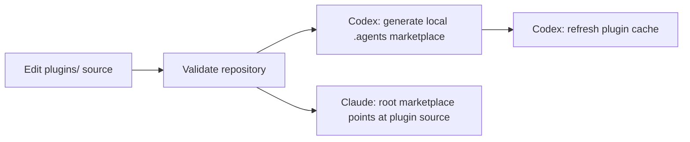

# Architecture

This repository separates plugin source from local runtime state. The Git tree
contains installable source packages; Codex, Claude, and Cursor generated
state is derived from those packages.

## Source Of Truth

`plugins/<name>` is the editable source tree for a plugin. A typical plugin
contains:

- `.codex-plugin/plugin.json` for Codex metadata;
- `.claude-plugin/plugin.json` for Claude Code metadata;
- `skills/` with `SKILL.md` entrypoints;
- `references/` for long contracts, source ledgers, scorecards, or runbooks;
- `scripts/` for deterministic helpers;
- `assets/` for icons and other media.

The root `.claude-plugin/marketplace.json` is the published Claude Code
marketplace for the collection. Cursor has no plugin marketplace;
`scripts/install-cursor-skills.py` copies plugin skills into Cursor's global
skills directory instead.

## Codex Install Model

Codex local plugins are loaded through a marketplace named `local`. The default
repository helper keeps the source of truth in this checkout:

```bash
python3 scripts/install-codex-plugins.py
```

The helper writes `.agents/plugins/marketplace.json` as local generated state,
configures Codex so `[marketplaces.local]` points at the repository root, and
materializes cache entries under `~/.codex/plugins/cache/local/<plugin>/<version>`.

The generated `.agents/` directory is intentionally ignored by Git. It belongs
to the local machine, not to the published source.

For compatibility with older local layouts, the installer can still copy source
to `~/plugins/<name>`:

```bash
python3 scripts/install-codex-plugins.py --global-source-root ~/plugins
```

That compatibility mode is explicit; it is not the default repository workflow.

## Claude Code Install Model

Claude Code uses the root marketplace:

```text
/plugin marketplace add Xopoko/plug-n-skills
/plugin install capability-workbench@xopoko-plug-n-skills
```

Each marketplace entry points to `./plugins/<name>`, where Claude reads that
plugin's `.claude-plugin/plugin.json` and shared `skills/` directory.

## Flow



## Publication Boundary

Commit:

- plugin source under `plugins/<name>/`;
- root documentation and validation scripts;
- `.claude-plugin/marketplace.json`;
- plugin manifests, references, scripts, tests, and assets.

Do not commit:

- `.agents/`;
- `~/.codex/plugins/cache/...`;
- bytecode, dependency folders, build output, or temporary files;
- local research corpora or synthesis scratch folders unless distilled into
  public source documentation.
