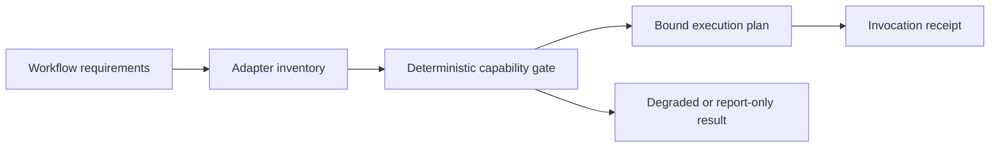
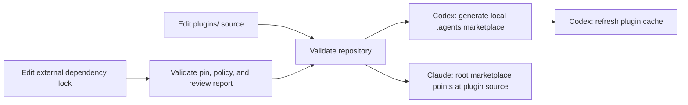

# Architecture

This repository separates plugin source from local runtime state. The Git tree
contains installable source packages; Codex, Claude, and Cursor generated
state is derived from those packages.

## Source Of Truth

`plugins/<name>` is the editable source tree for a plugin. A typical plugin
contains:

- `.codex-plugin/plugin.json` for Codex metadata;
- `.claude-plugin/plugin.json` for Claude Code metadata;
- `skills/` with `SKILL.md` entrypoints;
- `references/` for long contracts, source ledgers, scorecards, or runbooks;
- `scripts/` for deterministic helpers;
- `assets/` for icons and other media.

The root `.claude-plugin/marketplace.json` is the published Claude Code
marketplace for the collection. Cursor has no plugin marketplace;
`scripts/install-cursor-skills.py` copies plugin skills into Cursor's global
skills directory instead.

## Codex Install Model

Codex local plugins are loaded through a marketplace named `local`. The default
repository helper keeps the source of truth in this checkout:

```bash
python3 scripts/install-codex-plugins.py
```

The helper writes `.agents/plugins/marketplace.json` as local generated state,
configures Codex so `[marketplaces.local]` points at the repository root, and
materializes cache entries below the active Codex home
(`$CODEX_HOME` when nonempty, otherwise `~/.codex`). A configured home is
canonicalized and must already be a directory; explicit config/cache paths
remain the recovery override.

The generated `.agents/` directory is intentionally ignored by Git. It belongs
to the local machine, not to the published source.

For compatibility with older local layouts, the installer can still copy source
to `~/plugins/<name>`:

```bash
python3 scripts/install-codex-plugins.py --global-source-root ~/plugins
```

That compatibility mode is explicit; it is not the default repository workflow.

## External Dependency Model

`external-dependencies.lock.json` records external agent-skill sources that are
relevant to first-party capability work but are not part of the published
plugin tree. Each entry binds provenance to a full Git commit and tree, names a
first-party reviewer, records license boundaries and a review report, and
declares an enforced policy.

Schema version 1 supports only `reference-only` dependencies. The trusted
repository validator rejects mutable refs, unknown executable fields, automatic
installation, execution, vendoring, unsafe paths, missing reviewers, and missing
review reports. Lock validation is offline and never fetches or runs candidate
code. The separate `verify-source` command performs one read-only GitHub API
lookup per selected dependency and proves that each pinned commit resolves to
its declared Git tree.

The lockfile is deliberately separate from Codex and Claude manifests because
neither host manifest provides a portable external Agent Skills dependency
contract. Codex, Claude Code, and Cursor installers ignore the lockfile. A
future activation flow must be designed and reviewed separately; changing a
lock entry alone cannot activate external code.


```mermaid
flowchart LR
  A["Pinned external source"] --> B["Offline lock validation"]
  B --> C["Reference-only review"]
  C --> D["Optional native distillation PR"]
  D --> E["Normal plugin validation and install"]
```

## Capability-Bound Tool Access

Domain workflows declare the operations they require instead of requiring one
CLI, MCP server, connector, or SDK. A deterministic selector validates a
task-local adapter inventory and emits a typed execution plan. Installation,
reachability, authentication, authorization, and operation support remain
separate states; an advertised tool is not automatically an eligible executor.

The first native implementation lives in `git-workflows`. It can bind GitHub or
GitLab operations to a host-exposed MCP tool, connector, authenticated CLI API
surface, or direct API client when that adapter proves the required semantics.
Provider-specific pagination, identity, exact-head, readback, and mutation
rules remain explicit. An opaque common-denominator adapter must degrade to a
read-only or report-only mode instead of claiming parity.


```mermaid
flowchart LR
  A["Workflow requirements"] --> B["Adapter inventory"]
  B --> C["Deterministic capability gate"]
  C --> D["Bound execution plan"]
  D --> E["Invocation receipt"]
  C --> F["Degraded or report-only result"]
```

The selector never installs tools, starts login flows, or probes a write by
performing it. Those effects remain explicit user-authorized lifecycle steps.
After an ambiguous mutation result, adapters cannot be switched to retry the
write; only authoritative readback may recover a unique receipt.

## Technology Evidence Model

`technology-intelligence` separates four layers that change at different
cadences:

- source snapshots record provenance, edition, retrieval time, content
  identity, methodology, licensing, and known bias;
- observations record source-backed maintenance, adoption, security, maturity,
  compatibility, cost, and operational signals;
- reviewed assessments apply explicit decision profiles and hard gates;
- runtime capability inventories describe what is installed, enabled,
  authenticated, healthy, and callable in one environment.

Evidence refreshes may produce a proposed diff, but they never silently change
an adoption disposition. Published recommendations remain versioned and
reviewable. Runtime inventory is short-lived input and is never committed as a
universal fact. The plugin uses local deterministic queries and validators; it
does not require an MCP server or a network request for ordinary use.

## Plugin Identity Migration

`gitlab-review`, `stacked-delivery`, and `git-worktree-safety` were consolidated
into `git-workflows`. Their focused skill contracts remain independently
triggerable inside the new package. The Codex and Cursor installers accept each
legacy plugin name as an alias for `git-workflows`. A targeted Codex
`git-workflows` install replaces legacy marketplace entries and reports old
enabled config, cache, and copied-source residuals without removing them.
Existing host state requires an explicit install, disable, or uninstall
lifecycle action and is never changed by source validation.

`codex-cli`, `claude-code`, and `scheduled-automation` were consolidated into
`agent-harness`. Their focused skills, MCP identities, scripts, references, and
runtime-proof contracts remain inside the new package. The Codex and Cursor
helpers canonicalize all three legacy package names to `agent-harness`,
deduplicate mixed legacy/canonical selections, and apply exclusions at the
canonical target. A targeted migration removes only the matching repo-owned
marketplace entries; config, cache, and copied-source residuals remain
read-only findings until an explicit host lifecycle action removes them.
The `agent-harness-engineering` and `agent-harness-evaluation` skills and their
exclusive contracts moved from Capability Workbench into the same target;
Capability Workbench remains a separate install for capability lifecycle work.

General plugin retirement follows the same source/runtime boundary. During an
install write, the Codex installer removes a generated marketplace entry only
when it uses the standard repo-owned `./plugins/<name>` source shape and the
canonical checkout no longer contains that plugin directory. Unknown custom
entries are preserved. Enabled config, cache, and copied-source residuals are
read-only findings until the host's explicit lifecycle removes them.

Claude Code has no repository-defined alias. Each migration is an explicit
install of the canonical ID, followed by explicit uninstall of that group's old
IDs at the same scope and a plugin reload. Cursor has no plugin marketplace;
its aliases select the consolidated source while unchanged focused skill names
converge into the same flat skill destinations. Repository helper aliases are
selection conveniences, not runtime plugin aliases.

For Claude Code, the Agent Harness migration is therefore explicit:

```text
/plugin install agent-harness@xopoko-plug-n-skills
/plugin uninstall codex-cli@xopoko-plug-n-skills
/plugin uninstall claude-code@xopoko-plug-n-skills
/plugin uninstall scheduled-automation@xopoko-plug-n-skills
/reload-plugins
```

## Claude Code Install Model

Claude Code uses the root marketplace:

```text
/plugin marketplace add Xopoko/plug-n-skills
/plugin install capability-workbench@xopoko-plug-n-skills
```

Each marketplace entry points to `./plugins/<name>`, where Claude reads that
plugin's `.claude-plugin/plugin.json` and shared `skills/` directory.

## Flow


```mermaid
flowchart LR
  A["Edit plugins/<name> source"] --> B["Validate repository"]
  B --> C["Codex: generate local .agents marketplace"]
  C --> D["Codex: refresh plugin cache"]
  B --> E["Claude: root marketplace points at plugin source"]
  F["Edit external dependency lock"] --> G["Validate pin, policy, and review report"]
  G --> B
```

## Publication Boundary

Commit:

- plugin source under `plugins/<name>/`;
- the inert external dependency lock and its public review reports;
- root documentation and validation scripts;
- `.claude-plugin/marketplace.json`;
- plugin manifests, references, scripts, tests, and assets.

Do not commit:

- `.agents/`;
- `~/.codex/plugins/cache/...`;
- bytecode, dependency folders, build output, or temporary files;
- local research corpora or synthesis scratch folders unless distilled into
  public source documentation.
